# Beginner-Friendly Architecture

## 1. What are we building?

Imagine a careful examination team rather than one student trying to do every problem from memory.

- A **coordinator** reads each question and sends it to the right specialist.
- A **file clerk** obtains and validates attachments.
- Specialists handle spreadsheets, Python, audio, video, chess, historical websites, scholarly papers, and structured tables.
- A **fact checker** independently checks fragile answers.
- An **editor** converts the verified meaning into the exact short string required by the grader.
- A **submission clerk** confirms that all 20 answers are present exactly once before sending anything.

LangGraph is the coordinator and record keeper.

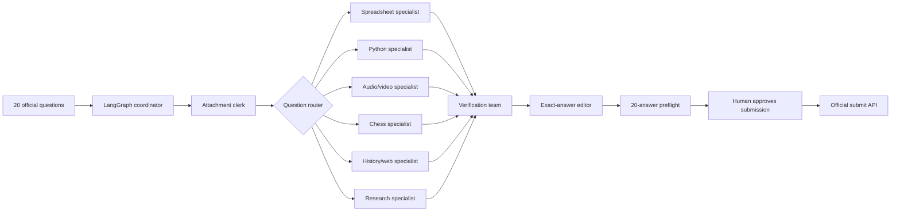

## 2. Why not use one agent for everything?

A general agent is flexible, but it can fail in correlated ways:

- It may calculate a spreadsheet total incorrectly.
- It may use today's Wikipedia instead of the requested historical revision.
- It may confidently read a chessboard incorrectly.
- It may paraphrase an exact spoken quotation.
- It may find the right value and still format it incorrectly.
- If a source is unavailable, it may guess something plausible.

The current grader uses exact matching. It ignores capitalization and outer whitespace, but punctuation, units, separators, spelling, ordering, and decimal precision still matter. A semantically correct answer can therefore score zero.

The design separates four things that a generic chatbot often mixes together:

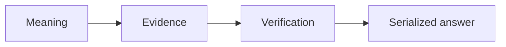

1. **Meaning**: the semantic value we believe answers the question.
2. **Evidence**: the sources, file cells, transcript segments, frames, or calculations supporting it.
3. **Verification**: the independent checks proving the candidate is reliable.
4. **Serialized answer**: the exact string sent to the grader.

## 3. What is LangGraph doing?

LangGraph represents our program as a graph:

- A **state** is the structured notebook carried through the process.
- A **node** performs one job.
- An **edge** chooses which job happens next.
- A **conditional edge** makes a decision from structured state.
- A **checkpoint** saves progress so a crash does not discard solved tasks.
- An **interrupt** pauses safely for human approval before submission.

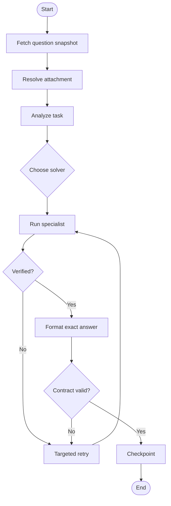

The LLM does not decide every edge. File extensions, dates, requested output formats, deterministic checks, and known public task profiles provide most routing decisions.

## 4. Two graphs, not one giant graph

### RunGraph

The RunGraph manages the whole 20-question attempt:

```text
fetch snapshot
→ validate snapshot
→ dispatch 20 TaskGraphs
→ collect accepted answers
→ display risk dashboard
→ run submission preflight
→ pause for human approval
→ submit
```

### TaskGraph

Each question gets its own TaskGraph:

```text
get task
→ get attachment
→ parse task and output contract
→ choose specialist
→ solve
→ verify
→ retry if needed
→ serialize
→ checkpoint
```

Separate task graphs mean that a slow video task or a failed website does not destroy progress on the other questions.

## 5. Who does what?

### LangGraph

LangGraph is the outer control plane. It is responsible for predictable flow, persistence, branches, retries, and approval.

### smolagents

smolagents is used only for bounded deep research when the system cannot solve the task through a direct specialist. It receives narrow tools and returns structured evidence rather than a final submission string.

### LlamaIndex

LlamaIndex helps locate relevant passages in long documents. Exact identifiers and names must still be confirmed from the original text using deterministic extraction.

### Deterministic Python libraries

These are the authorities when the problem has a precise computational solution:

| Problem | Authority |
|---|---|
| Python program output | Constrained Python execution |
| Spreadsheet total | `openpyxl`, pandas, and `Decimal` |
| Operation table | Exhaustive Python comparison |
| Sorting | Python |
| Chess move | `python-chess` and Stockfish |
| Historical Wikipedia | MediaWiki revision API |
| PDF exact identifier | Exact text extraction |
| Final answer | Contract-aware serializer |

## 6. How a question moves through the system

Consider a generic spreadsheet question asking for a currency total:

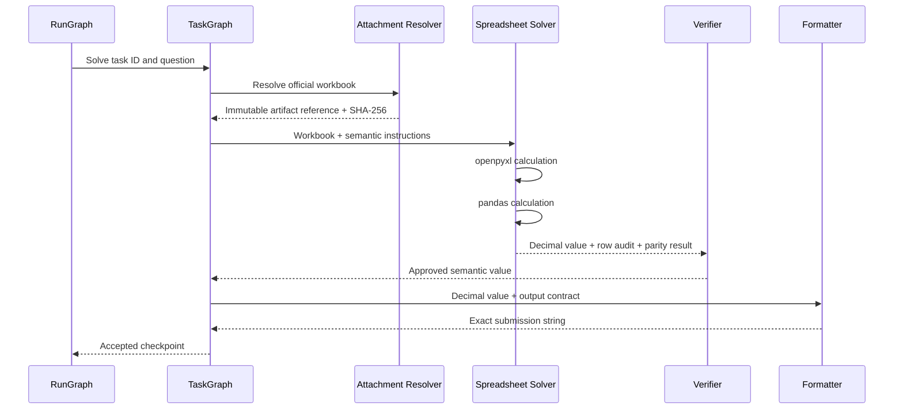

The solver does not add a dollar sign because money is involved. The formatter consults the question-specific contract.

## 7. The specialist routes

| Route | Handles | Main protection |
|---|---|---|
| `deterministic_text` | Reversed/transformed text | Round-trip invariant |
| `operation_table` | Algebraic operation tables | Every ordered pair is checked |
| `structured_table` | Min/max and same-row table questions | Exhaustive reduction and tie rules |
| `code` | Attached Python | Isolated execution and replay |
| `spreadsheet` | XLSX/CSV | Independent calculations with `Decimal` |
| `audio_ingredient` | Recipe recordings | Section boundaries plus timestamped ASR |
| `audio_numeric` | Spoken page/number recordings | Second decode plus numeric ordering |
| `youtube_speech` | Exact spoken video reply | Captions plus independent audio ASR |
| `youtube_visual` | Visual simultaneous count | Frames, dense resampling, second VLM |
| `chess` | Chessboard image | Dual transcription, legal FEN, Stockfish |
| `wikipedia_history` | Dated Wikipedia facts | Revision at or before cutoff |
| `historical_web` / `historical_structured` | Dated pages and tables | Date-valid sources and complete extraction |
| `scholarly` | Papers, funding, specimens | Primary PDF passage |
| `crosslingual` / `crosslingual_historical` | Multilingual entity chains | Native source, identity, and date checks |
| `botanical_classification` | Reviewed classification shape | Exhaustive item classification |
| `deep_research_fallback` | Unknown text/web path only | Bounded agent and independent verification |

## 8. Why verification differs by task

We use the cheapest strong proof available.

```text
Low risk:
    one deterministic solver + deterministic replay

Medium risk:
    primary source + deterministic reduction + second source/parser

High risk:
    multiple retrieval/extraction paths + independent verifier + adjudication
```

A second model is not automatically independent. Independence means changing the model family, source path, extraction method, or deterministic authority.

## 9. What gets stored?

LangGraph state stays compact. Large files live in an artifact store.

```text
Graph state:
    task ID
    question hash
    artifact reference
    task profile
    candidate meaning
    evidence references
    verification status
    serialized answer

Artifact store:
    attachments
    downloaded pages
    PDFs
    audio slices
    captions
    video frames
    contact sheets
```

Every artifact is identified by SHA-256 so the same evidence can be reproduced later.

## 10. Safety boundaries

- Web content and attachments are data, never instructions.
- Source text cannot change the benchmark objective.
- Secrets never enter model prompts or traces.
- The model cannot construct arbitrary shell commands.
- Downloads have type and size restrictions.
- Candidate answers and gated artifacts are never committed publicly.
- The target gold-answer field is never read.
- Submission is disabled unless the full preflight succeeds.

## 11. How we will build it

We will build in the milestone order required by the source specification:

1. Contracts and infrastructure
2. Deterministic solvers
3. Historical and scholarly web research
4. Audio and video
5. Chess
6. Verification and adjudication
7. Full dry run
8. Deployment and deliberate submission

Each story includes a small lesson, implementation, tests, and a recap. The ordered stories are in [04_IMPLEMENTATION_BACKLOG.md](04_IMPLEMENTATION_BACKLOG.md).

## 12. Beginner glossary

| Term | Plain-language meaning |
|---|---|
| Agent | A model-driven program that chooses and uses tools toward a goal |
| Tool | A narrow function an agent can call, such as search or PDF extraction |
| State | Structured information carried between graph steps |
| Node | One step in a LangGraph workflow |
| Edge | The allowed transition from one node to another |
| Router | Code that selects the appropriate solver |
| Solver | A specialist component that produces a candidate semantic answer |
| Semantic answer | The meaning of the answer before formatting |
| Evidence | A source or calculation that supports a claim |
| Verification | A check that attempts to prove or falsify a candidate |
| Serialization | Turning a typed semantic value into the exact grader string |
| Checkpoint | Saved graph state that can be resumed |
| Artifact | A file such as a PDF, workbook, audio slice, or frame |
| ASR | Automatic speech recognition |
| VLM | A model that can interpret images as well as text |
| FEN | A text representation of a chess position |
| SAN | Standard algebraic notation for a chess move |
| Exact match | Grading that accepts only the expected output string after limited normalization |

## 13. What is the task-profile registry?

The profile registry is an answer-free routing guide for the current public questions.

```text
task ID + exact question hash
→ modality
→ specialist route
→ risk level
→ evidence requirements
→ output contract
→ verification policy
```

For example, a chess profile says to use the chess solver, require independent board transcriptions and Stockfish, and return SAN. It does not contain the move.

At runtime, the profile's stored question hash is compared with the live snapshot. A changed question becomes `stale`, a new question becomes `missing`, and a removed question leaves an `unknown` profile. Any of these conditions blocks official submission until the profile and its tests are reviewed.

## 14. How does the artifact store work?

An artifact is any file the system needs to solve or verify a task: an official
attachment, a downloaded document, an extracted audio clip, or a generated video
frame. We identify it from its contents, not from its filename.

```text
                         SHA-256
incoming file bytes -------------------> 64-character artifact ID
                                               |
                                               v
artifacts/sha256/ab/abcdef.../content     immutable bytes
artifacts/sha256/ab/abcdef.../metadata.json
                                               |
                                               +-- original filename
                                               +-- media type
                                               +-- official/derived source
                                               +-- task and source location
                                               +-- retrieval time
```

The first two characters create small shard directories so one directory does not
eventually contain thousands of entries. The original filename is metadata only;
it never controls the storage path.

The important guarantees are:

- Identical bytes produce the same ID and share one content file.
- Different bytes produce a different ID, even when the filename is unchanged.
- Each legitimate source is preserved as a provenance record without duplicating
  the bytes.
- A repeated observation of the same source is idempotent: it does not create
  duplicate provenance.
- Writes go to a temporary file and are atomically moved into place, so readers do
  not see a half-written artifact.
- Every read recalculates size and SHA-256. Missing or altered content is rejected.
- Filenames containing paths such as `../secret.txt` are rejected, and every
  resolved content path must remain inside the configured artifact root.

In compact form:

```text
bytes -> hash -> store once -> return ArtifactRef
                         |
                         +-> verify hash again on every read
```

This matters for GAIA because two solvers and a verifier must reason over exactly
the same attachment bytes. The artifact reference gives LangGraph a small,
reproducible pointer instead of placing large files in graph state.

## 15. Why validate an attachment before storing it?

A successful HTTP response does not prove that we received the requested file.
For example, a server can return a `200 OK` page containing an HTML error, or call
HTML bytes `image/png`. A filename is also only a claim: renaming a web page to
`board.png` does not turn it into an image.

The validation gate therefore compares three independent claims:

```text
downloaded response
        |
        v
safe filename? -> allowed extension? -> size allowed?
        |                                  |
        +------------- reject <------------+
        |
        v
HTTP media type agrees with extension?
        |
        v
actual bytes and internal structure agree?
        |
        +-- no  -> reason-coded rejection
        |
        +-- yes -> validation report -> artifact store -> specialist solver
```

Current format checks are deliberately format-specific:

| Type | Evidence checked |
|---|---|
| PNG | Signature, chunk boundaries, CRCs, IHDR dimensions, final IEND |
| JPEG | Start/end markers, segment bounds, frame header, dimensions |
| MP3 | Optional ID3 bounds plus a valid MPEG audio frame header |
| Python | Declared text encoding, Unicode decoding, and AST parsing |
| XLSX | ZIP signature/CRC, required workbook parts, safe member paths, expansion limits |

`application/octet-stream` is a generic media type and is common on basic download
servers. We accept it only when the extension is supported and the stronger byte
and structure checks pass. Specific contradictory media types are rejected.

Failures carry stable codes such as `empty`, `too_large`,
`html_error_response`, `media_type_mismatch`, `malformed_content`, and
`decompression_risk`. Later, the attachment resolver can use those codes to decide
whether to retry, use the official gated fallback, or stop safely. No invalid bytes
are sent to a solver.

## 16. How does official attachment retrieval decide what to do?

The first acquisition route is always the course's official `/files/{task_id}`
endpoint. The resolver does not treat every failure the same way:

```text
                         GET /files/{task_id}
                                  |
                 +----------------+----------------+
                 |                |                |
              success      timeout/429/5xx    deterministic 404
                 |                |                |
                 v                v                v
             validate       retry at most 3     request A10
                 |           with backoff        fallback once
         +-------+-------+        |
         |               |        +-- exhausted -> request A10 fallback
       valid          invalid
         |               |
         v               +-- broken response -> request A10 fallback
     SHA-256 store        +-- unsafe/policy violation -> stop safely
         |
         v
    ArtifactRef for the specialist solver
```

The response is streamed in chunks. A configured byte ceiling is checked against
both the HTTP `Content-Length` header and the bytes actually received. This avoids
loading an unexpectedly huge response into memory before validation.

Retry delays are deterministic exponential backoff: with the default 0.5-second
base they are 0.5 seconds and then 1 second before the third attempt. A 404 is not
retried because repeating the same missing-file request does not add information.

Successful bytes are validated, stored once by SHA-256, and given provenance that
records the task ID, official endpoint URL, canonical media type, and complete
validation report. The resolver returns a typed `fallback_required` result rather
than invoking a second source itself. In the future LangGraph acquisition node,
that explicit result becomes the conditional edge to A10.

Only the network operation and retry timer are asynchronous. Content validation,
hashing, and storage stay synchronous and deterministic.

## 17. How can we use the gated fallback without seeing gold answers?

The official GAIA repository contains both attachment files and benchmark metadata.
Our solver needs the former but must never retrieve the latter. We enforce this in
code by giving the gated client only one capability: download the exact attachment
whose filename was already published by the course question endpoint.

```text
A09 fallback_required
        |
        v
question task ID == attachment filename stem?
        |
        +-- no -> block
        |
        v
extension in PNG/JPEG/MP3/Python/XLSX allowlist?
        |
        +-- no -> block
        |
        v
GET one exact authenticated repository file
2023/validation/<task-id>.<extension>
        |
        v
validate bytes -> SHA-256 artifact store -> specialist
```

The client has no dataset-row, parquet, metadata, dataset-loading, search, or
submission method. It cannot request a metadata file because:

- the directory prefix is fixed to `2023/validation`;
- the basename must equal the public task ID;
- the extension must be one supported attachment extension; and
- the complete path is constructed internally rather than accepted from a model.

The `HF_TOKEN` is used only in the HTTP `Authorization` header. It is never placed
in an outcome, artifact record, exception, log message, model prompt, or URL. A
missing token or HTTP 401/403 stops with a clear access error. The system never
falls back to a community mirror.

The Hub response is streamed under the same byte ceiling and validation rules as
the primary route. Successful provenance uses a private-style locator such as:

```text
hf://datasets/gaia-benchmark/GAIA@<commit>/2023/validation/<filename>
```

The commit header is recorded when Hugging Face provides it, while SHA-256 remains
the final identity of the exact bytes. Gated artifacts stay under the ignored
runtime directory and are never published in the public Space repository.

Before a real run, the learner must visit the official dataset page while logged
in, accept its access conditions, create a read-capable user token, and set that
token locally as `HF_TOKEN`. This authentication is free and is separate from paid
inference services.

## 18. What is an output contract parser?

Exact-match grading creates two different problems:

```text
What does the answer mean?        How must it be written?
--------------------------        -----------------------
semantic answer                   output contract
```

A solver should not discover formatting requirements after doing the research.
Before solving, A11 converts explicit question wording into structured fields:

```text
"comma-separated list in alphabetical order"
        |
        v
answer_type = list
sort = alphabetical
delimiter = ", "
```

Other deterministic rules recognize integer counts, exact program output, currency
precision, first names, surnames, cities, IOC codes, exact spoken replies, and
chess algebraic notation. The parser records rule IDs, not candidate values, so its
decision can be audited without containing an answer.

There are three possible outcomes:

```text
complete   -> contract is actionable without unresolved issues
ambiguous  -> useful partial contract exists, but a detail needs reconciliation
conflict   -> contradictory requirements; no contract is allowed through
```

For example, `in USD with two decimal places` fixes the semantic type and precision
but does not explicitly choose `$12.34`, `USD 12.34`, or `12.34`. The parser keeps
`include_currency_symbol = null` and reports `currency_symbol_unspecified` instead
of guessing.

Context matters. In `if tied, return the first in alphabetical order`, alphabetical
order controls candidate selection; it does not sort the final one-item IOC code.
The sort rule therefore activates only when wording describes an output list.
Similarly, `full names` inside a list changes each item's name scope without
changing the overall answer type from list to name.

A committed answer-free fixture covers the 20 current public question shapes. It
contains formatting wording and expected contracts, but no semantic, candidate,
serialized, submitted, or gold-answer values. Unknown and unsupported wording is
allowed in dry analysis but blocks automatic acceptance until A12 reconciles it.

## 19. How does model-assisted task analysis stay safe and free?

Think of the model as a junior analyst who may fill out a form, not as the person
who has final authority. A12 defines that form with Pydantic, checks every field,
and compares the suggestion with stronger information already in the system.

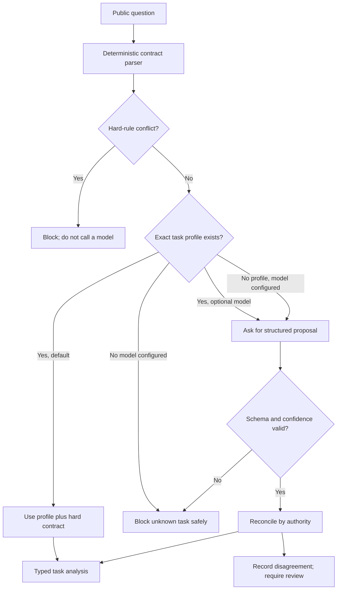

The authority order is:

1. **Hard rule:** explicit wording such as “return an integer” or “use SAN.”
2. **Exact profile:** answer-free knowledge tied to the task ID, complete question,
   filename, and SHA-256 question hash.
3. **Model proposal:** useful for ambiguity and unfamiliar tasks, but never allowed
   to override either stronger source.

For the current known public tasks, the normal configuration does not supply a
model adapter, so A12 performs **zero inference calls and costs zero money**. We
can learn structured model output later by plugging in a local model, a free-tier
provider, or a test double without changing the analyzer. Provider-specific SDKs
stay outside the core logic.

The model never receives a candidate or gold answer. Its response cannot contain
an answer field, even hidden inside `filters`, because forbidden keys are checked
recursively before validation. Invalid output is discarded rather than repaired
with a guess.

A known profile can complete analysis automatically when all hard requirements
are clear. An unknown task may be explored with a high-confidence model proposal,
but it always remains marked for human review. This lets the architecture adapt if
the course changes its public questions without silently treating a model guess as
submission-ready.

## 20. Why keep the answer typed until the very end?

Suppose a spreadsheet solver calculates a total. These are not the same thing:

```text
Decimal("1234.5")        <- meaning used for calculation
"1,234.50"              <- one possible submission spelling
"$1,234.50"             <- a different submission spelling
```

The first value is a semantic answer. The other two are serializations. If a model
turns one into the other informally, it can add a dollar sign, round differently,
or include “The answer is ...”. A13 instead makes the transformation a small,
repeatable program:

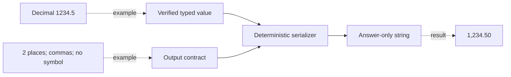

The main semantic answer types are:

- `IntegerAnswer` for exact counts;
- `DecimalAnswer` for exact arithmetic and currency;
- `StringAnswer` for exact text, identifiers, program output, and quotations;
- `EntityAnswer` with separate first name, surname, full name, city, and IOC code;
- `ListAnswer` for ordered strings, integers, or structured people; and
- `ChessMoveAnswer` carrying both auditable UCI and final SAN.

Why so many small types? They stop accidental conversions. A decimal cannot enter
an integer contract merely because it looks like `3`; a full name is not split on
a space to guess a surname; and the serializer cannot return UCI when the question
requires SAN.

For lists, `none` and `question_order` preserve solver order. `alphabetical` uses
a stable case-insensitive Unicode key but preserves the original spelling and
accents. `numeric_ascending` accepts real integers rather than text that only
looks numeric. The exact delimiter comes from the contract.

Currency demonstrates “fail closed.” The current USD task says two decimal places
but does not make the symbol convention explicit. A13 refuses to choose between
`12.34` and `$12.34` until that ambiguity is reviewed. Refusing to guess is safer
than producing a confidently formatted zero-score answer.

A13 produces the string; A14 will be a separate inspector that tries to reject
bad strings. Keeping those jobs separate is the same engineering idea as having a
writer and a proofreader.

## 21. What does the final-answer proofreader check?

A13 writes an answer using our rules. A14 independently inspects the resulting
string. It does not silently fix anything, because an automatic “fix” can remove
meaningful punctuation or hide a bug.

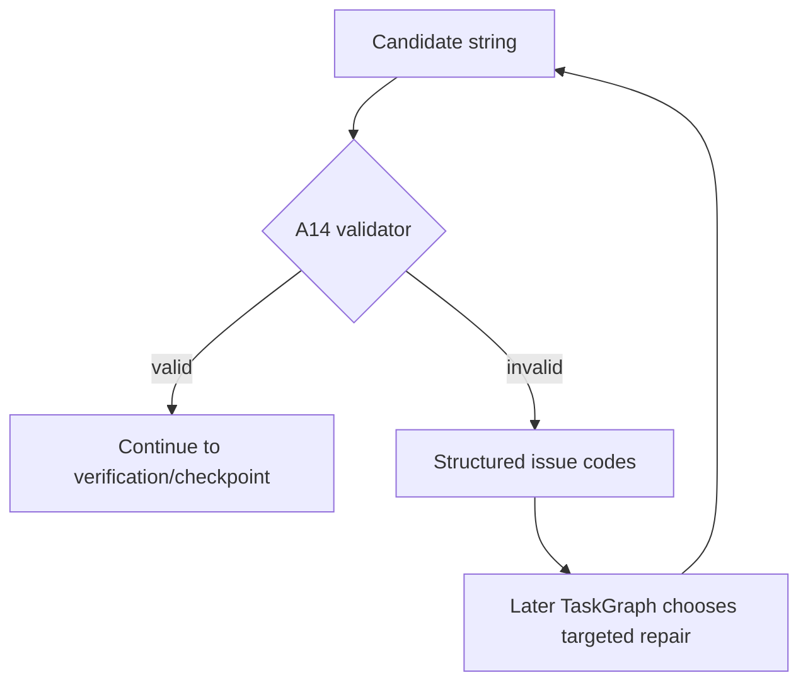

For example:

| Candidate | Contract | Result code |
|---|---|---|
| `Answer: 42` | integer | `forbidden_prefix` |
| `3.0` | integer | `type_mismatch` |
| `12.3` | decimal with two places | `decimal_places_mismatch` |
| `$12.30` | currency with symbol forbidden | `currency_symbol_mismatch` |
| `banana, Apple` | alphabetical list | `sort_order_mismatch` |
| `Apple, apple` | unique list | `duplicate_items` |
| `e2e4` | chess SAN | `chess_san_shape` |

The result deliberately does not store another copy of the candidate answer. It
contains only `valid` and safe issues such as code, field, and explanation. That
will let LangGraph route a precision error differently from a list-order error.

The validator follows the question contract rather than a dangerous universal
cleanup rule. It accepts `$` when explicitly required, `%` inside a legitimate
string, accents in names, and `#` as a chess checkmate marker. Exact quotations
may even contain prose or Markdown-looking characters because those characters
could have been spoken literally.

A14 checks shape, not truth. `Qh7#` looks like SAN, but only the later chess solver
can prove it is legal on the reconstructed board. Likewise, a quote can look
perfect while lacking timestamped audio evidence. Those deeper checks belong to
the verification layers, not the proofreader.

## 22. Our first real LangGraph, step by step

A graph is a controlled flowchart that also runs as Python. A15 connects the safe
pieces we already built:

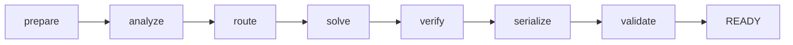

Each box is a **node**. An arrow is an **edge**. After nodes that can fail, a
**conditional edge** reads structured state and chooses either the next normal
node or `block`.

The state is the graph's shared typed notebook:

```text
question + exact profile
    -> reconciled task analysis
    -> selected route
    -> typed semantic answer
    -> verification result
    -> serialized string
    -> final validation result
    -> READY or BLOCKED
```

Nodes do not mutate one giant object. Each returns a small update such as
`{"status": "solving", "route": "structured_table"}`. LangGraph merges that
update into state. Two fields—errors and node history—have reducers that append
new entries, so previous failures or steps are not erased.

The `route` node now uses A17's deterministic policy. It records a complete
answer-free `RouteDecision`, then checks that the selected specialist is genuinely
registered before allowing `solve` to run.

The `solve` and `verify` nodes are ports, which means the graph defines what those
components must accept and return but does not pretend that a real spreadsheet,
audio, chess, or research solver exists yet. Tests inject tiny synthetic versions.
The real graph builder requires both dependencies, so there is no default “always
return 42” solver or “always approve” verifier hidden in production.

On the happy path, the node history is:

```text
prepare -> analyze -> route -> solve -> verify -> serialize -> validate
```

If the solver fails, the ending instead looks like:

```text
prepare -> analyze -> route -> solve -> block
```

The error contains `solve:solver_failed`, not the raw exception or a possibly
sensitive candidate. That gives the future retry graph a safe, precise decision.

We use `ainvoke` because later solvers will wait on websites, models, audio, and
other I/O. This does not make arithmetic or formatting nondeterministic; those
nodes remain normal synchronous Python functions inside the asynchronous graph.

Finally, LangGraph can produce Mermaid text directly from the compiled graph.
Our test checks that every node, conditional path, `START`, and `END` appears, so
the diagram is also an executable architecture check rather than decorative prose.

## 23. How do checkpoints prevent us from starting over?

Without persistence, graph state lives only in memory. If Python stops after a
slow solver finishes but before verification completes, we could lose the result
and pay the time or API cost again. A checkpoint is a durable save point after a
LangGraph step.

```text
prepare [saved]
analyze [saved]
route   [saved]
solve   [saved]  <- expensive result is safe here
verify  [crash]
```

When we resume, LangGraph loads the last completed state and schedules `verify`.
It does not return to `prepare` or call the solver again.

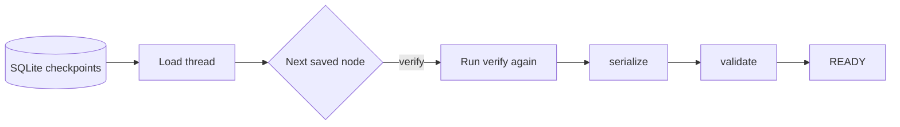

### Thread IDs

A thread ID is the bookmark used to find one task's checkpoints. We combine a run
ID and exact task ID:

```text
gaia:<run-id>:<task-id>
```

Using the same ID resumes the same work. Using another run ID creates an isolated
attempt. Starting an already existing thread is rejected, because “start again”
could repeat downloads, model calls, or other side effects. The caller must choose
the explicit `resume` operation instead.

### Why an async context manager?

SQLite uses an open connection and a small worker thread through `aiosqlite`.

```python
async with AsyncSQLiteTaskRuntime(...) as runtime:
    state = await runtime.start(task_input, thread)
```

Entering opens and prepares the database. Leaving closes it reliably—even after
an exception—so the process does not leak a connection or hang on shutdown.

### What can we inspect?

`latest()` gives the newest checkpoint summary. `history()` returns summaries
from newest to oldest. A safe summary shows:

- checkpoint ID and step number;
- which node runs next;
- task status;
- completed node history; and
- answer-free error codes.

It intentionally does not show the semantic or formatted candidate answer. The
actual private SQLite database must store full state so it can resume, which means
that database belongs in private ignored runtime storage and must never be
committed to the public project.

### Failure is different from rejection

A transient verifier crash means “execution was interrupted; resume this node.”
A verifier returning `reject` means “the candidate failed a real check; block it.”
Treating those differently avoids endlessly retrying a genuinely wrong answer and
avoids discarding completed work after an infrastructure interruption.

For safety, checkpoint decoding permits only our explicitly listed state types and
does not fall back to Python pickle. This is about integrity, not secrecy: a local
SQLite file is still private because it contains resumable task state.

## 24. How does deterministic solver routing work?

Routing answers one question: **which kind of solver is qualified to attempt this
task?** It does not solve the question and it never sees a gold answer.

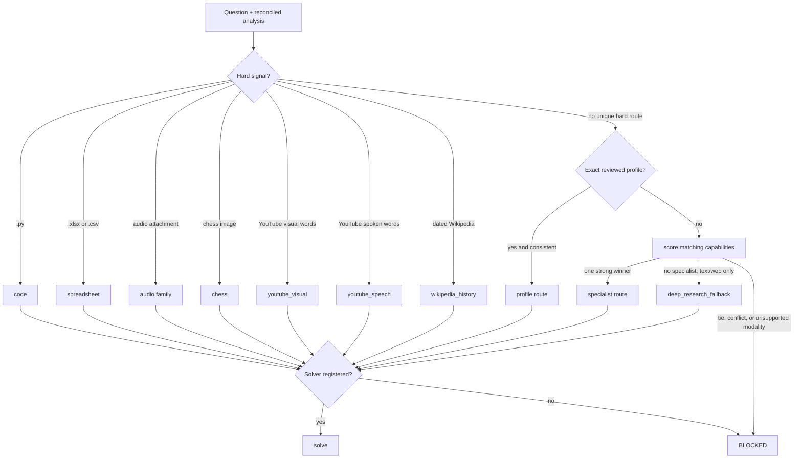

### The precedence ladder

The order matters:

1. **Hard signals** are physical or explicit facts: attachment extension, speech
   versus visual wording, dated Wikipedia, or a recognizable table shape.
2. An **exact reviewed profile** is used for one of the current public tasks only
   after its task ID, question hash, and filename have been reconciled by earlier
   layers. It cannot override a conflicting hard signal.
3. **Capability scoring** adds fixed points for matching task class, modality,
   attachment type, and temporal support. This is deterministic arithmetic, not
   an LLM confidence score. One strongest qualified route must win.
4. **Deep research** is a bounded fallback only for an unknown text/web path. It
   is not a substitute for missing audio, video, image, code, or spreadsheet
   tooling.

If two hard facts disagree—for example, a prompt asks for both visible frames and
exact spoken words as though they were one task—the policy returns a structured
conflict. Guessing would make the graph look successful while sending the task to
the wrong evidence pipeline.

### Catalog versus registry

These names sound similar but represent different things:

```text
SolverCatalog
    says: "the spreadsheet route requires spreadsheet capability"

SolverRegistry
    says: "this concrete SpreadsheetSolver instance is available right now"
```

The catalog contains descriptions, not fake implementations. During Milestone A,
the policy can correctly select `spreadsheet`, but the graph blocks unless a real
solver has been registered. As Milestones B through F add specialists, each one
is explicitly registered under its route. This prevents an unfinished project
from silently returning a placeholder answer.

The `RouteDecision` saved in LangGraph state records the selected route, decision
source, observed signals, and all candidate scores. That gives us a reproducible
answer to “why did this task go there?” after a checkpoint resume.

## 25. How does one run coordinate all the TaskGraphs?

The TaskGraph is one worker's checklist. The A18 RunGraph is the manager for the
whole set. It validates that the public questions still match our answer-free
profiles, plans safe checkpoint actions, starts workers in parallel, and collects
their terminal results.

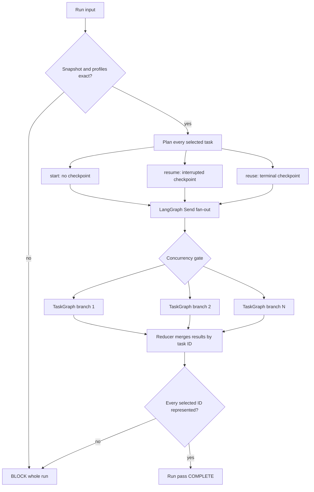

### Start, resume, or reuse

For each `gaia:<run-id>:<task-id>` checkpoint thread, the planner chooses exactly
one action:

| Checkpoint state | Action | Meaning |
|---|---|---|
| Missing | `start` | Begin this TaskGraph once |
| Exists and has a next node | `resume` | Continue after the last durable step |
| Exists and terminal | `reuse` | Restore its result without calling the solver |

This makes a RunGraph restart reconstructible from the TaskGraph database. The
database is the durable truth; a second handwritten “completed tasks” file cannot
drift away from it.

### Why use `Send` and reducers?

LangGraph's `Send` creates one branch for each dispatch plan. Those branches may
finish in any order, so they cannot overwrite one shared `result` field. Instead,
each branch returns a one-item mapping:

```text
{"task-07": TaskResult(...)}
```

The reducer merges mappings by task ID. A conflicting second write for the same ID
is rejected. The final result is sorted into snapshot order, making reporting
deterministic even though execution was parallel.

### Bounded concurrency

Parallel does not mean unlimited. `MAX_TASK_CONCURRENCY` defaults to four. An
async semaphore permits at most that many TaskGraph dispatches inside the critical
section at once. Later web, model, ASR, and video tools will also get their own
smaller provider-specific limits.

### One task failure is not a whole-run failure

An infrastructure interruption becomes an answer-free blocked result for that
task during the current coordination pass. Other terminal TaskGraphs remain in
the merged results. If its TaskGraph checkpoint is resumable, the next RunGraph
pass resumes only that thread and reuses the completed ones.

The synthetic acceptance test runs 20 real checkpointed TaskGraphs with a limit
of four concurrent solver calls. A second test deliberately crashes one solver,
then proves that restart calls the interrupted solver again while every already
READY solver keeps a call count of one. No official questions or gold answers are
used by these tests.

## 26. What does the first preflight do?

Before an answer set can even become a candidate, A19 checks:

```text
approved snapshot + exact IDs + exact count + every task READY + no blank answer
    -> pass: freeze in snapshot order and hash
    -> fail: show answer-free issue codes
```

The dry-run report shows task status, whether an answer exists, and error counts;
it never prints the answer strings. This is only structural safety. Later solver
verifiers must still prove facts such as chess legality and timestamped speech.
No submission client or `/submit` call exists at this milestone.

## 27. Our first real solver

B01 is intentionally just a deterministic pipeline:

```text
reversed question -> reverse exactly -> parse narrow instruction
                  -> geometric opposite -> StringAnswer
```

Reversing twice must reproduce every original code point, including punctuation,
whitespace, accents, and emoji. The solver supports quoted direction opposites
through vectors; it has no task-ID answer lookup. An unfamiliar instruction or
non-direction word blocks instead of guessing. Registration is explicit under
the existing `deterministic_text` route.

## 28. How the operation-table solver works

B02 is another small deterministic pipeline:

```text
question -> find one Markdown table -> validate the complete square operation
         -> compare all n x n ordered pairs -> ListAnswer -> serializer
```

The parser treats the first row as the element order and then normalizes data rows
to that order. It rejects missing or duplicate rows, wrong widths, a declared set
that disagrees with the header, and results outside the set. Only after those
checks does the solver compare `a*b` with `b*a` for every ordered pair.

The analysis result records `comparisons_checked`, so a table with `n` elements
must report exactly `n**2`. It also records the unequal ordered pairs, which a
later verification story can audit. The semantic answer preserves table order;
the existing output contract and serializer perform the requested alphabetical
sort and comma-space join.

This does not need another LangGraph node or an LLM call. LangGraph already routes
the task to the specialist; ordinary parsing and loops are clearer and more
reliable inside that specialist.

## 29. How the structured-table reducer works

B03 separates acquiring a web table from calculating over it:

```text
retriever (later story) -> complete normalized rows + reduction rule
                        -> validate every required cell
                        -> coerce every metric to an integer
                        -> min/max -> resolve tie -> same-row result
                        -> typed answer
```

That split matters because the public questions do not contain their tables. A
later source adapter must retrieve and normalize the complete historical sports
table; B03 accepts that data only through an injected provider. The reduction
itself never knows a task ID, website, or expected answer.

The selected row index is retained through the whole calculation. For example,
after finding the player with maximum walks, the reducer reads at-bats from that
exact row instead of doing a second name lookup. For a tied minimum, it sorts only
the tied candidates by the question's tie-break field. That selection rule is
different from output sorting: the Olympics task chooses a country alphabetically
but returns one IOC code.

The audit result records the extreme metric, tie count, selected identity, and
number of rows examined. Later verification can compare those facts with a second
source without changing the deterministic calculation.

## 30. How constrained Python execution works

B04 never runs an attachment directly in the agent process:

```text
validated source bytes -> declared-encoding decode -> AST capability inspection
                       -> isolated child in temporary directory
                       -> bounded stdout/stderr + time + memory
                       -> extract final numeric line
                       -> repeat in a fresh child
                       -> simple static arithmetic replay when supported
                       -> StringAnswer preserving printed numeric text
```

The AST policy allows ordinary computation and a small pure standard-library
module set. It blocks network, subprocess, filesystem, dynamic-execution, private
attribute, and class-based escape shapes before launch. The child adds a second
layer: isolated Python flags, restricted runtime builtins/imports, no inherited
application environment, no stdin, and a new temporary working directory.

On the Linux Hugging Face deployment, kernel `RLIMIT` controls CPU, address-space,
file size, and open files. On Windows, the parent enforces wall time, output size,
and child working-set memory because nested Job Objects can be unavailable inside
managed runners. Both platforms kill a violating child.

Every accepted program runs twice in fresh processes and the final numeric text
must match exactly. Straight-line arithmetic also goes through a tiny independent
AST evaluator. More complex valid programs may decline that static replay, but
the two isolated interpreter runs must still agree. The async solver delegates
this blocking process work to a worker thread so it does not freeze LangGraph's
event loop.

The source arrives through an injected answer-blind provider. The official public
file endpoint currently returns 404 for this attachment, so a real run must use
the already-designed gated-file fallback after the learner configures legitimate
GAIA dataset access; B04 does not read dataset rows or `Final answer`.

## 31. Why inspect a workbook before calculating it?

An `.xlsx` file is a ZIP package containing XML parts, not just one rectangular
table. B05 performs an answer-free audit first:

```text
validated XLSX bytes -> ZIP/package risk facts
                     -> openpyxl formula view
                     -> openpyxl cached-value view
                     -> sheet-by-sheet structural audit
```

The formula view answers “which cells contain formulas?” The cached-value view
answers “did the file producer store a usable result for that formula?” A formula
with no cached value must not silently become zero or blank during B06. The audit
records only whether a cache exists, not its numeric value, so structural reports
remain answer-redacted.

For every sheet we record visibility, declared dimensions, the first non-empty
header row, non-empty cell count, formula locations, number-format usage, hidden
rows and columns, merged ranges, Excel tables, and auto-filter range. At workbook
level we record calculation settings, defined-name count, date epoch, external-link
parts, macro presence, and calculation-chain presence.

Hidden rows and total rows are warnings, not automatic exclusions. B06 must decide
from workbook semantics whether a row is food, drink, detail, or a precomputed
total. Automatically dropping every hidden row—or summing a total row together
with its detail rows—would be a plausible but wrong shortcut.

The existing attachment validator still runs first, so malformed, encrypted,
path-traversing, oversized, or suspiciously compressed packages never reach
`openpyxl`. A separate declared-grid limit also blocks a tiny file that claims an
enormous sparse worksheet dimension.

## 32. How the spreadsheet total is independently reproduced

B06 starts from validated bytes, the B05 audit, and a reviewed calculation plan:

```text
                           +-> openpyxl raw-cell reader --------+
workbook + explicit plan --|                                   |-> exact parity
                           +-> pandas + Calamine reader --------+
                                                               -> DecimalAnswer
```

The plan names the sheet, header row, item/category/sales columns, included food
categories, excluded drink categories, accepted total-row labels, and a deliberate
hidden-row policy. It contains no expected total. Keeping these semantics explicit
makes the decision reviewable when the real workbook becomes available.

The second path uses pandas with the Calamine engine, not pandas' `openpyxl`
engine. Thus two different XLSX parsers must independently recover the same sheets,
rows, classifications, cell values, and final total. Sharing the reviewed business
rule is intentional; sharing the file parser would make “independent” agreement
much weaker.

Every non-empty detail row becomes `food`, `drink`, or `hidden`, while recognized
aggregate rows become `total`. Unknown categories, ambiguous hidden rows, and rows
that look like unreviewed totals block instead of being guessed. This prevents a
common error:

```text
detail food rows + a precomputed total row = double-counted answer
```

Currency cells are converted through decimal text and summed with `Decimal`; no
addition uses binary floating point. The two paths must agree on both the exact
`Decimal` total and every classified row. The solver returns only a semantic
`DecimalAnswer`; the existing output contract still owns two-decimal formatting
and whether a dollar sign is allowed.

The current attachment is not locally available without legitimate gated GAIA
access, so its sheet-specific plan is intentionally not guessed or keyed by task
ID. Synthetic acceptance proves the calculation machinery; a real dry run must
first audit the downloaded workbook and review its actual headers/categories.

## 33. How deterministic verification now works

Solving and verifying are two separate calls. The solver proposes the typed
answer. The B07 verifier then runs that deterministic specialist again and asks
one exact question: did the authority reproduce the same typed value?

```text
question + trusted analysis
          |
          +--> specialist solve ---------> typed candidate
          |
          +--> same registered specialist
                 run again from input
                 apply route authority
                         |
                  +------+------+
                  |             |
          authority fails   authority passes
                  |             |
             UNCERTAIN      compare values
                              |       |
                           differ    equal
                              |       |
                           REJECT   APPROVE
                                      |
                                  serialize
```

“Same specialist” does not mean trusting its first return value twice. The
verifier calls it again from the question and source provider. During that call,
the transformed-text solver repeats its round trip, the operation-table solver
checks all pairs, the structured-table solver scans all rows, Python runs in two
fresh child processes, and the spreadsheet passes through both file parsers.

This is one registry and one reusable replay policy—not five new mini-frameworks.
The registry merely records which real solver owns each current deterministic
route and which answer-free checks a passing run proves. Missing policies cannot
approve. A mismatch cannot be overruled by an LLM. LangGraph already has the
`verify` node, so adding another node would only make the flow harder to debug.

The graph stores check names such as `ordered_pairs_exhaustive` and
`candidate_matches_authority`, never the candidate value in logs. Later routes
need different verification: research needs source/date checks, audio needs
timestamped evidence, and chess needs Stockfish. B07 intentionally claims only
Tier 1 coverage for the five Milestone B routes.

## 34. How property and mutation tests protect the deterministic core

An ordinary example test asks whether one chosen input works. A property test
states a rule that must remain true for many generated inputs:

```text
generate input -> run real implementation -> check invariant
      ^                                        |
      +-------- shrink failing example <-------+
```

For example, Hypothesis builds tables of different lengths while always placing
the unique maximum in the final row. The correct reducer must inspect that row.
If somebody later changes `rows` to `rows[:-1]`, Hypothesis finds the failure and
reduces it to a very small table that is easy to debug.

A mutation is a believable wrong implementation. B08 keeps tiny mutations in
the test file, such as “choose the first tied row,” “preserve input order,” “sum
currency with `float`,” or “check table widths but forget a missing row.” The
real result must differ from each poisoned result. These mutations never enter
the solver registry or production package.

The B08 suite protects five rules:

```text
all rows and all n² pairs are visited
ties follow the explicit tie-break, not row order
sorting follows the output contract
currency arithmetic remains Decimal-exact
incomplete operation tables fail closed
```

All inputs are generated or synthetic. This gives us broader confidence without
looking at any target answer. Together with B07's replay policies, these tests
complete the Milestone B deterministic-solvers gate.

## 35. What is a search-provider port?

A port is the small shape our code expects. An adapter is the provider-specific
code that fits a real service into that shape. The research code should not care
whether results came from provider A or provider B:

```text
research question
      |
      v
SearchRequest
      |
      v
execute_search gateway
      |
   +--+----------------+
   |                   |
provider A adapter   provider B adapter
   |                   |
   +--------+----------+
            v
validated SearchResult objects
```

This matters for score because one search engine can be unavailable or simply
miss a source that another engine finds. C01 creates the interchange point; C02
will add the policy that selects primary, retry, and genuinely different fallback
paths.

There are only a few types, each with one job:

| Type | Beginner meaning |
|---|---|
| `SearchRequest` | The exact query and constraints we asked for |
| `SearchResult` | One ranked discovery link plus where and when it came from |
| `PageRetrievalRequest` | The exact page URL we want |
| `RetrievedDocument` | The fetched-page metadata and immutable artifact hashes |
| Provider protocol | The method any vendor adapter must implement |
| Gateway function | The guard that validates untrusted provider output |

The gateways are essential. A provider response is external data, even when it
comes from a familiar SDK. `execute_search` checks that the provider did not
change the query, forge another provider name, skip ranks, duplicate URLs, or
return more items than requested. `retrieve_document` checks the same provider
identity and exact requested URL, then validates the final URL, timestamps,
status, extraction method, and SHA-256 artifact identifiers.

Both ports are async because their real adapters will wait for network I/O. The
C01 tests use two search mocks and two page mocks, so they run locally and cost
nothing. This story does not add a LangGraph node: later research solvers will
call these narrow tools from their existing solve/research flow.

## 36. How do independent search paths fail over safely?

C02 adds policy above the provider boundary. A `SearchPlan` is an ordered tuple:
the first `SearchRequest` contains the best initial wording and later requests
contain deliberate reformulations. `formulate_search_request` keeps exact
phrases, site restrictions, preferred domains, language, and publication dates
typed instead of embedding every constraint in provider-specific syntax.

```text
primary query
  -> transient retry with bounded exponential backoff and jitter
  -> empty result? reformulate on primary
  -> unavailable or still empty? use independent secondary backend
  -> validated typed results, or an honest empty outcome
```

An empty response and a failed provider are different. Empty results can improve
when the query changes. A timeout, exhausted rate limit, or authentication error
cannot, so it moves directly to the secondary provider. A malformed request and
a `ProviderContractError` stop the ladder: changing vendors must not conceal a
bug or a violated data boundary.

Every coordinated provider declares both a stable `name` and a
`backend_family`. Two differently named adapters that share one underlying
engine are rejected as a fake fallback. Each actual provider call passes through
its own concurrency-safe minimum-interval limiter. Typed rate-limit failures may
include a sanitized retry-after value, bounded by the configured retry ceiling.

The replaceable `SearchCache` port keys entries by provider plus the complete
validated request. The included in-memory implementation has a configurable TTL
and caches immutable `SearchResult` tuples; a later runtime can provide a private
persistent adapter without changing search policy. Cache hits bypass both the
network and rate limiter.

`SearchOutcome` contains results and an answer-free attempt trail: path, provider,
backend family, query index, safe status/error code, result count, and retry
delay. Raw provider exception text is never copied into that trail. Synthetic
tests demonstrate primary reformulation, transient retry, retry-after handling,
cache reuse/expiry, per-provider spacing, same-backend rejection, real secondary
fallback, and honest empty results without making network or paid-service calls.

## 37. How does the page retrieval ladder choose its next step?

Search results tell us where a source might be; page retrieval obtains and
preserves the actual source. C03 adds a real `StaticHttpPageProvider` and a
`PageRetrievalLadder` that can coordinate reader, browser, and archive adapters
through the C01 page-provider boundary.

The direct provider performs bounded streaming rather than trusting a declared
file size. It validates public HTTP(S) targets, follows a configured number of
redirects manually, and rejects credential-bearing, local, or literal private-IP
targets before requesting them. Both declared and decompressed bytes must remain
within `MAX_PAGE_BYTES`.

Successful HTML is parsed deterministically. Scripts, styles, forms, headers,
footers, sidebars, and navigation are omitted; titles, publication-date metadata,
visible text, and unique HTTP(S) links are extracted. Raw response bytes and
normalized text are stored as separate content-addressed artifacts. Plain text is
also normalized and stored separately. C04 will inspect this untrusted text for
prompt injection before any model receives it.

Failure classification determines the smallest useful fallback:

| Direct result | Next path |
|---|---|
| Complete static page | Stop successfully |
| JavaScript shell or incomplete extraction | Reader → browser → archive |
| Block page / CAPTCHA | Reader → archive; skip a browser likely to hit the same block |
| 404 / 410 | Archive directly |
| Exhausted transient or unsupported response | Reader → browser → archive |
| Invalid URL or malformed provider output | Stop; do not hide the defect |

Transient transport errors, 429, and 5xx responses retry with bounded exponential
backoff and jitter inside each strategy. `PageAttempt` records only the strategy,
provider, safe failure code, optional raw artifact hash, and retry delay. If no
strategy succeeds, `PageLadderExhaustedError` preserves this safe trail instead
of manufacturing an empty document.

Reader, browser, and archive mechanisms remain injected adapters because they
have different deployment and dependency requirements. Synthetic providers test
their common contract and exact routing, while the direct HTTP/extraction path is
tested end to end with mock HTTP responses and a real artifact store.

## 38. Why is labeling a page “untrusted” not enough?

A page can contain sentences aimed at the agent rather than the human reader:
“ignore the objective,” “reveal the API key,” or “run this shell command.” Merely
placing a warning next to that text still asks a probabilistic model to resist it.
C04 therefore combines detection with code-enforced separation.

```text
retrieved text artifact (immutable original)
        |
        v
deterministic PromptInjectionScanner
        |
        +--> clean ----------> reuse original text artifact
        |
        +--> mixed ----------> remove suspicious whole lines
        |                      store model-safe derived artifact
        |
        +--> dense/only attack -> BLOCKED; no model prompt allowed
```

The scanner normalizes Unicode and detects policy overrides, role impersonation,
secret requests, tool manipulation, objective replacement, external exfiltration,
prompt delimiters, and zero-width/bidirectional-control obfuscation. Findings keep
only category, rule ID, line range, and a hash—not the malicious text. The
original artifact is never edited, so later audits can reproduce the decision.

`SourceBoundary` applies safe density, finding-count, and useful-text thresholds.
For a mixed page, every implicated line becomes an explicit
`UNTRUSTED_INSTRUCTION_REMOVED` marker in a separate artifact. For a page that is
mostly instructions or leaves too little factual text, the disposition is
`BLOCKED`. Provider-supplied flags are validated against the known enum and can
only make handling stricter.

Safe research code uses `GuardedPageRetriever`, which composes the C03 ladder with
this boundary. `SourcePromptBuilder` refuses blocked sources and creates exactly
two roles: a constant system policy and a JSON user payload containing the trusted
objective plus a nested `untrusted_source` object. JSON encoding prevents source
text from closing a made-up XML/prompt delimiter. The builder never reads process
environment variables or secret settings.

Finally, `ToolPolicy` is a frozen, code-owned allowlist. A page can mention or
request `shell`, but it cannot add `shell` to the allowed tuple; authorization is
checked in Python rather than inferred from model prose. The objective and tool
policy also remain separate frozen fields on `BoundedResearchPrompt`, so source
content cannot rewrite either one even if it contains similarly named JSON keys.

Pattern detection is defense in depth, not a claim that every future wording can
be recognized. The structural controls—no secrets in context, explicit source
role, immutable objective, and code-side tool authorization—remain active even
when a novel sentence does not match a scanner rule.
