# Detailed System Design

## 1. Architectural goals

The system is optimized in this order:

1. Correctness
2. Evidence quality and verification
3. Exact output compliance
4. Reliability under API and network failures
5. Reproducibility and observability
6. Cost
7. Latency

The design is deliberately more structured than the starter template because a 20/20 attempt must eliminate correlated failure modes across web, history, audio, video, image, code, spreadsheet, and formatting tasks.

## 2. Architectural decisions

### ADR-001: LangGraph is the outer orchestrator

**Decision:** Use LangGraph `StateGraph` for the RunGraph and TaskGraph.

**Reason:** The project needs explicit control, branches, persistence, retries, fault recovery, parallelism, and a human submission gate. These are central LangGraph concepts taught in the course.

**Guardrail:** LangGraph is not permission for a generic ReAct agent to decide every transition. Most edges are determined by typed state and deterministic policy.

### ADR-002: Specialist solvers precede deep research

**Decision:** Route to domain-native solvers before an open research agent.

**Reason:** Python, spreadsheets, sorting, operation tables, and chess all have stronger deterministic authorities than a language model.

### ADR-003: smolagents is a bounded research backend

**Decision:** Wrap a smolagents research worker behind a `DeepResearchBackend` interface and invoke it from a LangGraph node/subgraph.

**Reason:** This provides course-aligned practice with planning, tools, and managed agents while containing open-ended behavior.

### ADR-004: LlamaIndex is a supporting retriever

**Decision:** Use LlamaIndex for semantic passage discovery in long documents only after exact extraction is available.

**Reason:** It is useful for learning and document navigation, but vector retrieval must not become the authority for exact identifiers or historical facts.

### ADR-005: Semantic answers and strings are different types

**Decision:** A solver cannot return a submission string as its authoritative output.

**Reason:** Exact-match formatting is a separate correctness dimension. Only the serializer may create the final string.

### ADR-006: Evidence is stored as structured claims

**Decision:** Every nontrivial candidate carries claim-level evidence records and evidence status.

**Reason:** A URL alone does not prove that the correct entity, date, or requested field was established.

### ADR-007: Runtime question integrity gates submission

**Decision:** Fetch and hash the live questions on every run. A changed or unknown profile blocks submission.

**Reason:** The public evaluation can change, and silently applying stale task assumptions risks invalid answers.

### ADR-008: Official sources only for attachments

**Decision:** Use the official file endpoint and then the official gated GAIA dataset. Community mirrors are diagnostic only.

### ADR-009: Official submission is an isolated capability

**Decision:** Keep submission code separate, disabled by default, and protected by configuration, preflight, and a LangGraph interrupt.

## 3. Component view

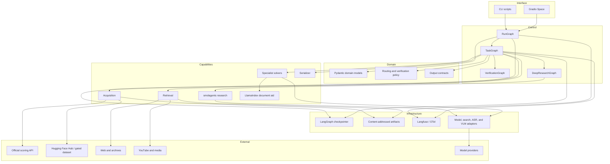

## 4. RunGraph design

### 4.1 Run state

```python
class GaiaRunState(TypedDict):
    run_id: str
    mode: Literal["dry_run", "submission"]
    configuration_status: str

    question_snapshot: QuestionSnapshot | None
    expected_profile_version: str
    snapshot_approved: bool

    pending_task_ids: list[str]
    task_results: Annotated[dict[str, TaskResult], merge_task_results]
    run_errors: Annotated[list[RunError], append_errors]

    risk_dashboard: RiskDashboard | None
    submission_manifest: SubmissionManifest | None
    submission_approved: bool
    submission_receipt: SubmissionReceipt | None
```

### 4.2 Run nodes

| Node | Responsibility | Failure behavior |
|---|---|---|
| `load_config` | Load environment and safe defaults | Block if essential config invalid |
| `validate_credentials` | Check only credential presence/capability, never log values | Produce actionable missing-capability report |
| `fetch_question_snapshot` | Fetch `/questions`, normalize, hash, persist | Retry transient HTTP failures |
| `validate_snapshot` | Check count, IDs, hashes, and profile version | Allow inspection but block submission |
| `plan_dispatch` | Select missing/failed/uncertain tasks | Resume accepted tasks without rerunning |
| `dispatch_tasks` | Invoke TaskGraphs with semaphores | Preserve completed task writes |
| `collect_results` | Merge minimal accepted/blocked results | No candidate string mutation |
| `build_dashboard` | Show route, evidence, verification, and risk | Always available in dry mode |
| `preflight_submission` | Enforce the complete submission contract | Any failure returns to repair or blocks |
| `approval_interrupt` | Pause for explicit user approval | Cannot be bypassed in submission mode |
| `submit_answers` | POST frozen payload | No automatic retry on ambiguous server response |
| `persist_receipt` | Store response and payload hashes | Redact credentials |

### 4.3 Concurrency

Tasks may run concurrently, but capabilities use independent semaphores:

```text
web requests       configurable, initially 6-10
primary LLM        initially 2-4
secondary LLM      initially 2-4
ASR                initially 1-2
video processing   initially 1
vision models      initially 1-2 per provider
```

Correctness-sensitive nodes should not share mutable global objects.

### 4.4 Implemented A18 coordinator

A18 implements the first executable RunGraph nodes:

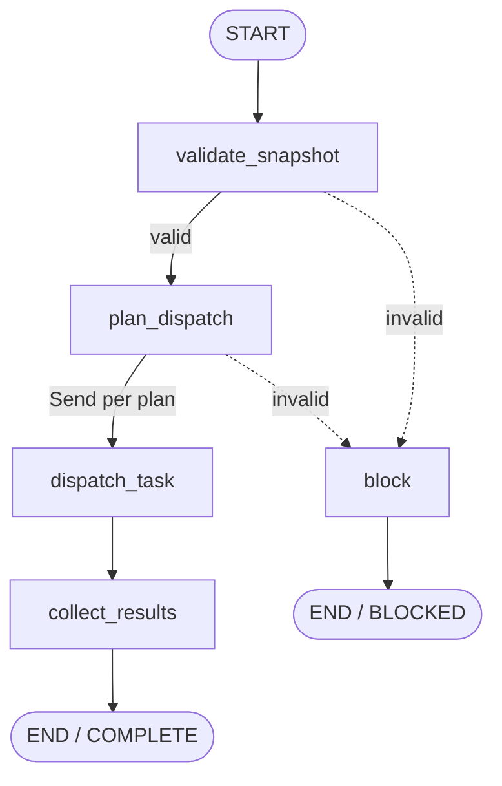

`RunGraphInput` contains a bounded run ID, immutable public snapshot, exact public
questions, answer-free profile registry, optional task subset, and expected count.
`validate_snapshot` independently rebuilds question hashes and the aggregate hash,
checks inventory/count, and requires full profile reconciliation before dispatch.

`plan_dispatch` inspects each per-task SQLite thread and chooses an idempotent
action:

```text
missing thread       -> START
thread with next     -> RESUME
terminal thread      -> REUSE
```

`REUSE` restores the terminal `TaskResult` from its checkpoint; it never invokes
the solver. Planning fails closed if checkpoint inspection or profile
materialization is inconsistent, because guessing between start and resume could
duplicate side effects.

The planner emits LangGraph `Send` objects, one for each immutable
`TaskDispatchPlan`. `dispatch_task` calls the checkpointed TaskGraph behind an
explicit `asyncio.BoundedSemaphore`. The default `MAX_TASK_CONCURRENCY=4` is a
run-level ceiling, not a replacement for the provider-specific limits that later
solver stories add.

Parallel branches return one-item `task_results` and `dispatch_records` mappings.
Reducers merge them by task ID, reject conflicting duplicate writes, and sort keys
for deterministic reporting. Answer-free run errors use a separate deduplicating,
sorted reducer. `collect_results` reaches `COMPLETE` only when every selected ID
has exactly one result and dispatch record.

A task execution interruption is isolated: the current pass records a blocked
task result and whether its checkpoint remains resumable, while other results are
retained. On a new RunGraph pass with the same run ID, terminal threads are reused
and only interrupted threads resume. Snapshot or planning failures instead block
the entire run before worker execution.

The RunGraph compiler accepts an optional LangGraph checkpointer for coordinator
observability. Durable recovery does not depend on it: task SQLite threads are the
authoritative progress records, allowing the coordinator plan to be reconstructed
after a process restart. Optional coordinator savers must use
`build_run_checkpoint_serializer()`, which extends the same explicit project-type
allowlist used by TaskGraph persistence and keeps pickle fallback disabled.

## 5. TaskGraph design

### 5.1 Status model

```python
class TaskStatus(StrEnum):
    NEW = "new"
    ACQUIRING = "acquiring"
    ANALYZING = "analyzing"
    SOLVING = "solving"
    VERIFYING = "verifying"
    RETRYING = "retrying"
    ACCEPTED = "accepted"
    SERIALIZED = "serialized"
    READY = "ready"
    BLOCKED = "blocked"
```

### 5.2 State invariants

- `attachment` is required when `file_name` is nonempty before solver execution.
- Reconciled `analysis` and its `output_contract` must exist before routing.
- If a reviewed `profile` is supplied, it must match the exact runtime question;
  unknown tasks may instead use a sufficiently strong structured analysis.
- A candidate must reference at least one evidence item unless the task is a pure deterministic transform.
- `semantic_answer` may be selected only from recorded candidates.
- `serialized_answer` may exist only after verification approval.
- `READY` requires all final checks to pass.
- `BLOCKED` must include a structured reason code and attempted fallback history.

### 5.3 Retry budget

```python
class RetryBudget(BaseModel):
    acquisition: int = 3
    analysis: int = 2
    primary_solver: int = 2
    alternate_solver: int = 1
    independent_retrieval: int = 2
    critic: int = 1
    adjudication: int = 1
```

Retries consume the relevant budget and must name what changed. Repeating the same query against the same source and model is not a new verification path.

### 5.4 Implemented A15/A17 task graph

A15 is the first executable LangGraph control plane. It uses `StateGraph`, typed
state, explicit `START`/`END` edges, and conditional edges. It deliberately has no
checkpointer yet; SQLite persistence and resume are A16.

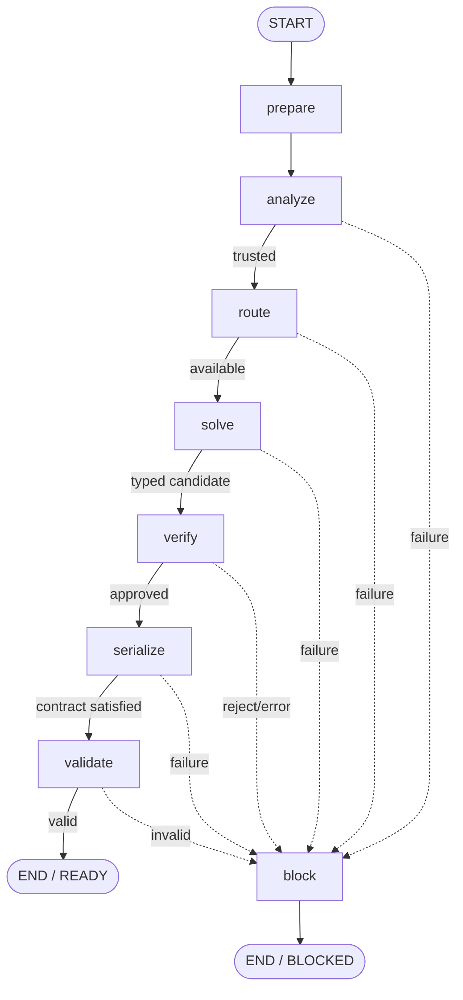

`TaskGraphState` contains the question, optional exact profile, reconciled analysis,
chosen route and `RouteDecision`, typed semantic answer, verification result,
serialized answer, structural validation result, safe errors, status, and append-only
node history. It contains
no gold or submitted-answer field. `errors` and `node_history` demonstrate
LangGraph reducers: every node contributes a small update rather than replacing
the accumulated list.

The graph is assembled with dependency injection:

```text
TaskAnalyzer      real A11/A12 reconciliation
SolverRegistry    explicit map of route to available specialist implementation
TaskVerifier      B07 deterministic registry; later policies extend the ladder
AnswerSerializer  real A13 implementation
FinalAnswerValidator real A14 implementation
```

There is intentionally no default solver, fallback solver, or approving verifier.
Synthetic test doubles demonstrate the graph, but production code cannot accidentally treat a
placeholder answer as benchmark truth. A17 routes through the registry and blocks
with `solver_not_registered` when the selected specialist has not been built yet.

Every capability boundary is runtime-validated. Solver output must validate as a
discriminated `SemanticAnswer`; verifier output must validate as
`VerificationResult`. Exceptions are converted into generic answer-free graph
errors. Rejection or uncertainty stops before serialization, and invalid final
text retains A14 detail codes for later targeted repair.

The graph runs asynchronously through `ainvoke` because future solver/verifier
nodes perform network and media I/O. Deterministic nodes remain ordinary
synchronous functions. `get_graph().draw_mermaid()` renders the architecture
locally without a browser or hosted diagram service.

### 5.5 Implemented A16 SQLite persistence and resume

A16 compiles the A15 graph with LangGraph's `AsyncSqliteSaver`. One
`AsyncSQLiteTaskRuntime` owns the async SQLite connection, checkpointer, and
compiled graph inside an `async with` lifecycle. The SQLite saver creates its
tables and enables WAL journal mode; graph calls request `durability="sync"` so a
checkpoint is persisted before execution advances to the next super-step.

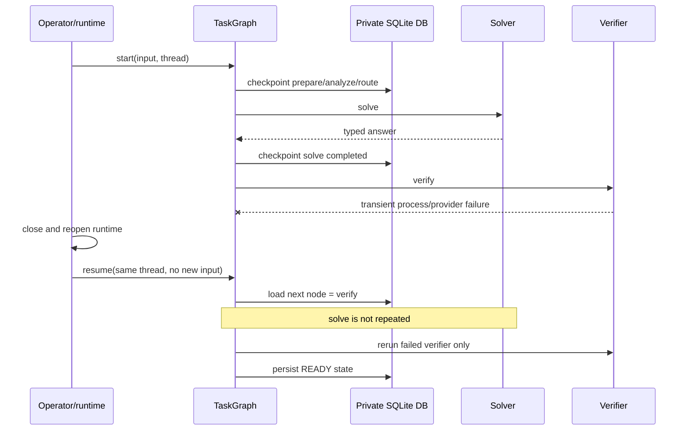

Thread identity is stable and explicit:

```text
TaskThread(run_id="dry-run-001", task_id="<official UUID>")
    -> gaia:dry-run-001:<official UUID>
```

Run/task components accept only bounded letters, digits, dots, underscores, and
hyphens. A fresh `start` refuses to reuse an existing thread; continuation must
use `resume`. Unknown and terminal threads also fail explicitly. This prevents an
operator from accidentally rerunning a completed task or mixing two task IDs.

Unexpected analyzer/solver/verifier exceptions use a special persistent mode:
the node raises a sanitized `TaskNodeExecutionError`, allowing LangGraph to retain
the last completed checkpoint. Deterministic schema rejection, verification
rejection, serialization failure, and output invalidity remain normal reason-coded
`BLOCKED` states. Thus infrastructure interruption and genuine task rejection are
not confused.

`latest()` and `history()` return immutable `TaskCheckpointSnapshot` summaries in
newest-first order. They include checkpoint/step identity, scheduled next nodes,
status, node history, and safe error codes. They do not include candidate,
semantic, serialized, or submitted answers. The SQLite file itself necessarily
contains private full graph state and therefore belongs under ignored runtime
storage, never in the public repository or Space assets.

Checkpoint deserialization uses an explicit allowlist of this project's state
models and enums. Pickle fallback is disabled. This reduces the risk that a
tampered local database could request construction of arbitrary Python types.

Tests close and reopen the runtime after a deliberate verifier crash. Resume runs
the verifier a second time while the solver call count remains one. Other tests
cover thread isolation, duplicate-start prevention, missing/terminal resume,
blocked-state history, safe IDs, lifecycle enforcement, and bounded history.

### 5.6 Implemented A17 deterministic routing and solver registry

The route subsystem has three deliberately separate objects:

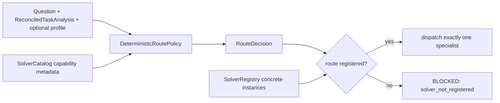

Selection precedence is hard signals, then an exact consistent reviewed profile,
then deterministic capability scoring, then a bounded deep-research fallback.
Hard signals include supported attachment extensions, YouTube visual/speech
intent, dated Wikipedia requirements, and operation/structured-table shapes. A
profile that conflicts with those signals is rejected. Equal strongest scores,
unsupported attachments, and conflicting hard signals are also blocking states.

`deep_research_fallback` is valid only for unresolved text or web work. It cannot
stand in for audio decoding, video frames, image transcription, Python execution,
or workbook inspection. This preserves modality evidence requirements on unseen
tasks instead of maximizing apparent completion at the expense of correctness.

The default catalog defines every stable route used by the 20 answer-free profile
records plus the generic fallback. A profile-only flag protects narrow hybrid
routes such as `historical_structured` and `crosslingual_historical`: unknown tasks
do not receive those specialized plans merely because a broad class happens to
match. Tests enumerate all 20 records, cover extension and wording rules, poison
conflicts and ties, and prove registry dispatch never substitutes another solver.

## 6. Domain models

### 6.1 Question snapshot

```python
class QuestionSnapshot(BaseModel):
    retrieved_at: datetime
    source_url: HttpUrl
    count: int
    task_ids: list[str]
    task_hashes: dict[str, str]
    snapshot_sha256: str
    attachment_task_ids: list[str]
    task_profiles_version: str
```

### 6.2 Task profile

```python
class TaskProfile(BaseModel):
    task_id: str
    question: str
    question_sha256: str
    file_name: str | None
    modality: Modality
    task_class: TaskClass
    temporal_constraint: TemporalConstraint | None
    requested_operation: str
    filters: dict[str, JSONValue]
    required_sources: list[SourceRequirement]
    output_contract: OutputContract
    verification_policy: str
    risk_flags: list[RiskFlag]
```

### 6.3 Evidence

```python
class Evidence(BaseModel):
    evidence_id: str
    claim: str
    source_url: str | None
    artifact_id: str | None
    source_type: SourceType
    source_date: str | None
    snapshot_date: str | None
    retrieved_at: datetime
    primary: bool
    excerpt: str | None
    locator: str | None       # page, timestamp, cell range, frame time
    extraction_method: str
    status: EvidenceStatus
```

`EvidenceStatus` is one of `NOT_FOUND`, `INDIRECT`, `PRIMARY`, or `INDEPENDENTLY_VERIFIED`.

### 6.4 Candidate answer

```python
class CandidateAnswer(BaseModel):
    candidate_id: str
    semantic_value: SemanticAnswer
    solver: str
    evidence_ids: list[str]
    deterministic_checks: list[CheckResult]
    unresolved_risks: list[RiskFlag]
    created_at: datetime
```

Model-reported confidence is not stored as authoritative confidence.

### 6.5 Verification result

```python
class VerificationResult(BaseModel):
    verifier: str
    tier: int
    verdict: Literal["APPROVE", "REJECT", "UNCERTAIN"]
    passed_checks: list[str]
    reason_codes: list[str]
    critique: str
    missing_evidence: list[str]
    evidence_conflicts: list[str]
    requested_next_action: NextAction | None
```

## 7. Provider abstraction

Models and services change. Domain code must depend on capability interfaces rather than vendor SDKs.

```python
class ResearchModel(Protocol): ...
class StructuredModel(Protocol): ...
class VisionModel(Protocol): ...
class ASRProvider(Protocol): ...
class SearchProvider(Protocol): ...
class BrowserProvider(Protocol): ...
```

Configuration roles:

```text
PRIMARY_RESEARCH_MODEL
SECONDARY_VERIFIER_MODEL
ADJUDICATOR_MODEL
VISION_MODEL_A
VISION_MODEL_B
ASR_PRIMARY
ASR_SECONDARY
SEARCH_PRIMARY
SEARCH_SECONDARY
```

Model selection is decided through a clean non-target regression harness, not reputation alone.

## 8. Acquisition and content-addressed storage

All significant inputs are immutable artifacts.

Cache key:

```text
sha256(bytes)
```

Metadata includes source URL, retrieval time, MIME, size, original name, task ID, and validation results.

Untrusted response bytes cross a validation boundary before artifact placement:

```text
official response
  -> safe basename and allowlisted extension
  -> nonzero configured size bound
  -> reject HTML error body/media type
  -> extension/media-type agreement
  -> format-specific signature and structure validation
  -> SHA-256 validation report
  -> content-addressed artifact store
```

PNG/JPEG dimensions and XLSX expansion are bounded to reduce decompression-bomb
risk. XLSX member paths must be relative and cannot contain traversal, drive, or
backslash forms. Validation failures expose stable reason codes to orchestration;
raw invalid content is never forwarded to a specialist solver.

The preferred endpoint resolver has an explicit typed outcome:

```text
resolved          -> validated ArtifactRef + attempts
fallback_required -> reason + attempts + optional validation reason
```

Only timeout/network errors, 429, and 5xx responses are retried. Backoff is bounded
by configuration. A deterministic 404, permanent response error, or broken file
response produces one fallback handoff without an internal loop. Unsafe filenames,
unsupported types, configured size violations, archive traversal, and
decompression-risk content block acquisition instead of weakening policy.

The official route stores `ArtifactSource.OFFICIAL_API` provenance, including the
task ID, exact `/files/{task_id}` locator, and the validation report whose SHA-256,
size, filename, and canonical media type must match the stored artifact.

The A10 gated client is deliberately not a general dataset client. It exposes one
answer-blind operation whose path is constructed as:

```text
2023/validation/{public_task_id}.{allowlisted_attachment_extension}
```

The expected filename must be a safe basename whose stem exactly equals the public
task ID. The client has no row, parquet, metadata, or dataset-loader API. It streams
only the exact official repository file with `HF_TOKEN`, applies the same byte
ceiling, and passes the response through A08 before A07 storage. Missing/denied
gated access and missing exact files fail loudly; there is no community-mirror
production fallback.

An A10 call is accepted only with a matching typed `fallback_required` result from
A09. Task-ID and filename mismatches block before HTTP. This makes the later
LangGraph edge explicit and prevents arbitrary callers from using the gated client
as a dataset browser.

The cache prevents:

- Redownloading media during retries
- Using different workbook versions across two calculations
- Verifying a different PDF than the solver read
- Losing the exact video frames that established a maximum

## 9. Retrieval design

### Search result

```python
class SearchResult(BaseModel):
    provider: str
    query: str
    rank: int
    url: str
    title: str
    snippet: str | None
    published_at: date | None
    retrieved_at: datetime
```

A snippet is discovery evidence only.

### Retrieved document

```python
class RetrievedDocument(BaseModel):
    provider: str
    requested_url: str
    final_url: str
    status_code: int
    title: str | None
    published_at: str | None
    retrieved_at: datetime
    artifact_id: str
    text_artifact_id: str | None
    links: list[DocumentLink]
    extraction_method: str
    injection_flags: list[str]
```

### Source hierarchy

Prefer:

1. Direct source named or linked by the question
2. Official first-party source
3. Authoritative structured database
4. Primary scholarly paper
5. Reputable secondary source
6. Wikipedia
7. Search snippet

The hierarchy is adjusted for Wikipedia-history questions, where the requested historical revision is itself the direct source.

### 9.1 Implemented C01 provider boundary

C01 defines provider-neutral async ports without selecting or paying for a search
vendor. Search and page implementations may change, but downstream research code
calls only two validated gateways:

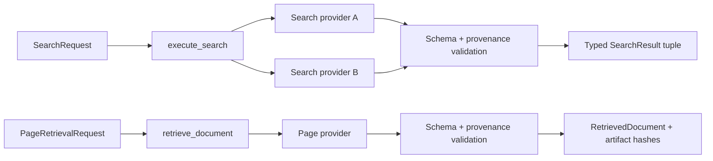

`SearchRequest` represents the constraints required by later stories: an exact
query (including quotes when needed), result limit, site restrictions, preferred
domains, language, and publication-date bounds. Domains are normalized as bare
DNS names; ambiguous paths, schemes, duplicates, bad language tags, reversed
date ranges, and extra fields fail before a provider call.

Each `SearchResult` carries provider name, exact query, contiguous rank, URL,
title, optional snippet/publication date, and an aware retrieval timestamp. The
gateway rejects a response that changes its provider/query provenance, exceeds
the requested limit, repeats a URL, skips a rank, or fails schema validation.
Snippets remain discovery hints and are not promoted to `Evidence`.

Page retrieval returns `RetrievedDocument`, which binds requested/final URLs and
HTTP status to raw and optional extracted-text artifact hashes. It also records
provider, timestamps, extraction method, extracted links, and the injection-flag
slot used by C04. Large page text stays in the artifact store rather than graph
state.

Provider exceptions are not converted into empty results. C02 needs to see a
timeout or rate limit to choose retry or a genuinely separate backend. Invalid
provider data instead raises the answer-free `ProviderContractError`; this is a
data-boundary failure, not a reason to trust a second malformed response.

Two different synthetic implementations of each port pass the same acceptance
tests. No network request, API key, cache, retry loop, provider fallback, browser,
or model call exists in C01; those behaviors remain in C02–C04.

### 9.2 Implemented C02 search-path policy

`SearchCoordinator` consumes the C01 provider port and requires primary and
secondary adapters to declare different names and different `backend_family`
values. This rejects aliases over one search engine as correlated fallback.

For every ordered `SearchPlan`, the coordinator uses this state machine:

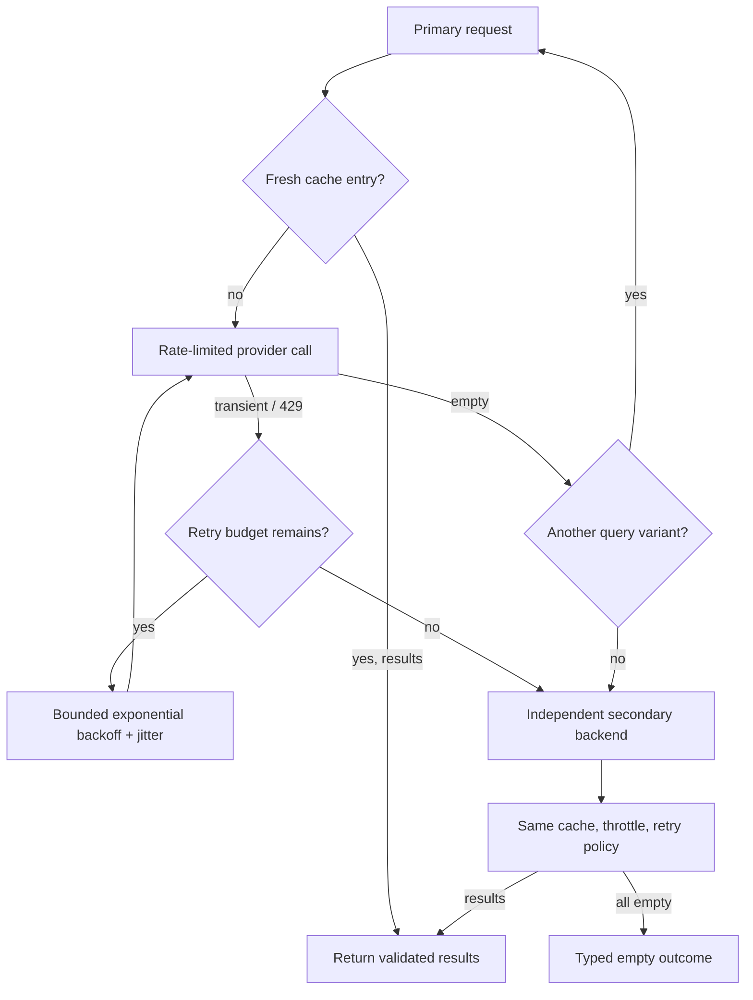

Authentication and deterministic provider failures are not retried; they move
to the independent backend. Invalid requests and `ProviderContractError` escape
immediately because fallback must not hide caller bugs or malformed untrusted
data. Generic timeouts and connection failures are treated as transient; other
unknown exceptions remain visible.

Query formulation supports exact phrases, site/preferred domains, native-language
tags, date bounds, and explicit reformulations. A cache port stores results by
provider and the full serialized request with a configurable TTL. The included
cache is concurrency-safe and process-local; its interface permits a private
persistent runtime adapter later. Separate minimum-interval limiters prevent one
provider's quota policy from throttling the other.

The policy is configured by validated search retry, jitter, TTL, and per-provider
spacing settings. Its `SearchOutcome` records only safe attempt metadata; it does
not turn snippets into evidence or include raw exception bodies.

### 9.3 Implemented C03 page retrieval ladder

`StaticHttpPageProvider` is the concrete direct strategy. It uses bounded async
streaming, manual redirect validation, public HTTP(S)-target checks, typed status
classification, and deterministic HTML/plain-text extraction. Raw bytes use
`ArtifactSource.WEB_RETRIEVAL`; normalized visible text is a separate derived
artifact. This keeps exact source bytes available for later C04/C07 verification
without placing page bodies in graph state.

The static extractor excludes navigation chrome and active/non-visible elements,
normalizes visible text, resolves and deduplicates links, and reads common
ISO-formatted publication-date metadata. A short script/root-only document is a
`JS_REQUIRED` failure. Block headers, block-page titles/leads, 401/403/451, 404/410,
429/5xx, unsupported media, empty content, and byte-limit violations remain
distinct typed failures.

`PageRetrievalLadder` accepts strategy-declared providers in fixed slots:

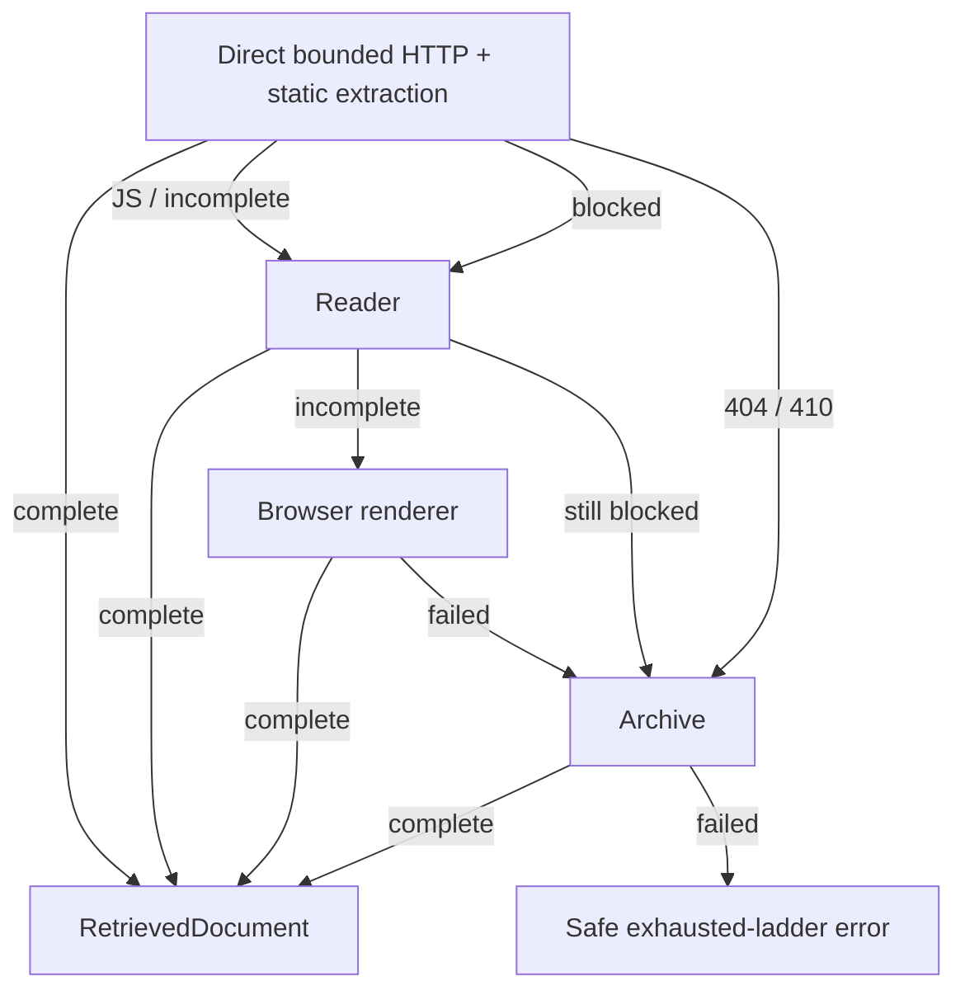

Every provider response still passes through C01 schema/provenance validation.
Contract violations and invalid requests stop immediately. Each strategy retries
only transient failures; all attempt records are answer-free and exclude response
bodies and raw exception messages. Reader/browser/archive adapters are injected
behind the same port so deployment-specific implementations do not alter routing
policy. Archive artifacts have a dedicated `WEB_ARCHIVE` provenance class for
those adapters; temporal validity remains C07's responsibility.

### 9.4 Implemented C05 historical MediaWiki client

`MediaWikiClient` uses the read-only Action API for page discovery, redirect
resolution, revision history, and exact old-revision content. A historical
lookup sends an aware UTC cutoff as `rvstart`, enumerates toward older revisions,
and independently selects the maximum timestamp satisfying `timestamp <= cutoff`.
The inclusive comparison is deliberate: a revision exactly at the requested
instant is eligible.

The selected record binds requested title, canonical title, page ID, revision ID,
parent ID, timestamp, SHA-1 when available, cutoff, and a permanent `oldid` URL.
Content retrieval then queries by that exact revision ID and rejects any page-ID,
revision-ID, or timestamp drift before storing the wikitext in the immutable
artifact store. Retrieval time and content-state time therefore cannot be
confused. Redirects are recorded rather than silently replacing the user's
requested identity.

The adapter has bounded pagination, response sizes, retries, and query limits.
It classifies missing pages separately from “no revision before cutoff,” ignores
untrusted search-result HTML snippets, and emits only sanitized error codes.
Synthetic tests prove order-independent inclusive selection, continuation,
redirect provenance, exact-content binding, immutable `oldid` provenance,
missing/temporal failures, and 429 retry behavior.

### 9.5 Implemented C06 historical Wikipedia extraction

`HistoricalWikipediaExtractor` reads only the artifact whose metadata contains
the selected revision's permanent `oldid` provenance. It rejects content newer
than the cutoff, invalid UTF-8, and provenance drift. Its discography path finds
exactly one `Studio albums` section, stops before live/compilation siblings,
parses list and wikitable records, prefers explicit release dates over reissue
years, and applies inclusive year bounds. Its FAC path considers only paragraphs
with explicit nomination language and extracts user identities there, preventing
reviewer/support signatures from being misclassified as nominators.

## 10. Temporal validity

Temporal constraints are first-class:

```python
class TemporalConstraint(BaseModel):
    kind: Literal[
        "revision_cutoff",
        "as_of",
        "publication_date",
        "event_period",
        "compiled_date",
    ]
    start: datetime | None
    end: datetime | None
    timezone: str = "UTC"
```

The temporal verifier asks:

- Does this source describe the requested historical state?
- Is the page revision or archive timestamp compatible with the cutoff?
- Is a present-day page explicitly documenting the old state, or merely showing current data?
- Could roster membership, nationality, award metadata, or article content have changed?

### 10.1 Implemented C07 archive and temporal policy

`WaybackClient` queries the CDX index with exact URL scope, successful-capture
filtering, digest collapsing, bounded results, and inclusive date parameters. It
validates the returned header and every capture row, binds captures to the same
host/path/query as the requested resource, and constructs raw `id_` replay URLs.
Malformed, foreign, oversized, and out-of-window results fail closed.

`validate_temporal_evidence` distinguishes revision state, archive snapshot,
contemporaneous publication, explicit retrospective documentation, and current
unqualified content. Revision/as-of cutoffs use inclusive `<=`; event and compiled
periods require the content state or publication inside the interval. A source
published today may pass only when its explicit documented period covers the
requested historical interval. `retrieved_at` is recorded but intentionally has
no role in the decision.

### 10.2 Implemented C08 PDF extraction ladder

`PdfExtractionLadder` preserves physical page numbers and immutable artifacts
through native PyMuPDF text, pypdf layout fallback, page rendering, and injected
OCR. A weak page falls through independently, so good native pages are not
replaced by a lower-priority backend. Every readable page stores normalized text;
render/OCR pages also retain the PNG used for recognition. Scanned pages without
an OCR engine remain explicitly unresolved instead of becoming empty evidence.

The ladder rejects non-PDF signatures, encrypted/invalid files, backend page-count
disagreement, unsafe backend identities, non-PNG renders, and configured page
limits. Exact literal search returns every match with its physical page, offsets,
bounded same-page context, and text artifact ID for scholarly verification.

### 10.3 Implemented C10 scholarly relationship extraction

`ScholarlyEvidenceExtractor` operates on C08 page artifacts. Funding extraction
requires the target author alias, agency, funding/award language, and exact award
identifier in the same passage; an affiliation or another author's award cannot
be transferred to the target. Specimen extraction likewise requires specimen/type
language and an explicit deposition construction, so author institutions and data
repositories are not mistaken for the eventual specimen depository. Zero or
multiple relationships fail as unresolved ambiguity, and every accepted result
retains the physical page and text artifact.

### 10.4 Implemented E01-E05 chess authority path

The chess path crops all 64 squares with explicit white/black orientation,
requires two complete independent occupancy transcriptions, records every
disagreement, and permits adjudication only for exactly those disputed squares.
It builds a full FEN and blocks any state rejected by `python-chess` before an
engine can run. The local UCI adapter requests bounded Stockfish MultiPV analysis,
checks every returned move is legal, requires the best line to be winning, and
uses the validated board—not a vision model—to generate and round-trip SAN.

## 11. Verification policy matrix

| Task class | Required checks |
|---|---|
| Pure transform | Structural + inverse transform |
| Operation table | Structural + exhaustive comparison |
| Python | Static inspection + sandbox run + replay/derivation |
| Spreadsheet | Workbook audit + two exact calculations + format check |
| Sports table | Full table parse + tie check + second source |
| Historical Wikipedia | Correct cutoff revision + deterministic extraction + revision-render cross-check |
| Historical web | Date-valid evidence + archive/independent source |
| Scholarly | Primary paper passage + entity/identifier relationship check |
| Exact audio/speech | Timestamp evidence + independent decode |
| Visual video | Whole-video coverage + dense resampling + second vision pass |
| Chess | Dual transcription + legal FEN + engine + SAN |
| Cross-lingual entity | Native/authoritative source + namesake and transliteration checks |
| Open research | Primary evidence + independent retrieval + critic when high risk |

## 12. Risk scoring

Risk is computed from observable features.

Positive evidence:

- Deterministic result reproduced
- Primary source
- Correct historical snapshot
- Two independent sources agree
- Independent extraction methods agree
- Secondary model agrees for a genuinely nondeterministic task

Negative evidence:

- Source unavailable
- Search snippet only
- Ambiguous entity
- VLM-only numeric answer
- ASR disagreement
- Current source used for historical task
- Tie or uniqueness not reproduced
- Candidate depends on inference rather than direct support

The score decides whether more compute is required. It never overrides a hard failed check.

## 12.5 Output-contract parsing

A11 runs before solving and applies deterministic hard-signal rules to question
text. It extracts answer type, list delimiter/order, decimal precision, units and
currency-symbol policy, name scope, item count, notation, separators, and trailing
punctuation. Every match records a stable rule ID.

The result status is `complete`, `ambiguous`, or `conflict`. A conflict never
produces a contract. An ambiguous result may retain a partial typed contract, such
as currency with known precision but unspecified symbol, while listing reason-coded
issues for A12 reconciliation. No generic string default is created when answer
type is unknown.

Rules distinguish output transformations from solver-selection instructions. For
example, an alphabetical tie-break used to select one country is not represented as
an alphabetical output sort. Hard-rule conflicts cannot be overwritten by a model;
the later analyzer may propose metadata only where rules are absent or explicitly
ambiguous.

## 12.6 Structured task analysis and authority

A12 adds an optional provider-neutral model adapter. It does not make an LLM the
judge of the task. It gives a model one narrow job: propose typed metadata for
modality, task class, requested operation, time constraint, filters, output
contract, risk flags, and confidence.

Only this answer-free request crosses the adapter boundary:

```text
task ID + public question + public filename
        + deterministic contract status/contract/issue codes
```

The response must match `TaskAnalysisProposal`. Extra fields, unsupported enum
values, malformed risks, non-JSON values, and answer-bearing keys at any nesting
depth are rejected. Backend exception details are kept out of the public error,
and the provider name is restricted to safe identifier characters.

Reconciliation follows a fixed authority order:

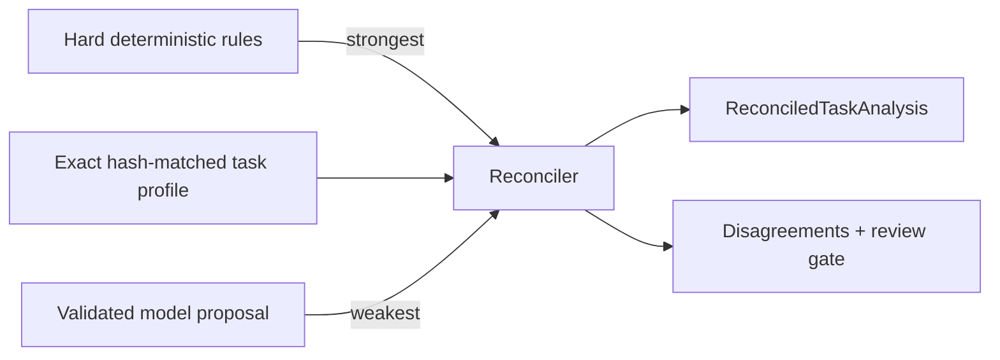

- A deterministic contract conflict stops before any model call.
- A hard output contract overrides both the profile and model.
- An exact profile controls known-task classification and operation metadata.
- The model may identify extra risks; policy preserves them and requires review.
- Every weaker-source disagreement is stored and blocks automatic submission.
- A known task needs no model at all, so the default learning path costs nothing.
- An unknown task needs a configured, high-confidence model proposal and always
  remains review-required; the model can help exploration but cannot auto-approve
  a newly seen benchmark item.

This is deliberately an analysis component, not a solver. Neither its request nor
its proposal has a candidate-answer, evidence, route-execution, or submission
field. LangGraph will call it from the later TaskGraph, after acquisition and
before deterministic routing.

## 13. Exact serializer

The A13 serializer is a pure deterministic module. It accepts exactly two inputs:
a discriminated semantic-answer model and an `OutputContract`. It returns an
answer-only string or a typed error. It has no model, prompt, network, evidence,
or submission capability.

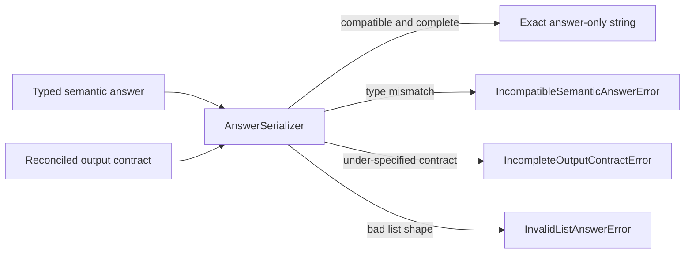

Semantic models keep information structured until the last possible moment:

| Meaning | Model | Important representation |
|---|---|---|
| Count | `IntegerAnswer` | Strict integer; booleans cannot masquerade as integers |
| Exact numeric value | `DecimalAnswer` | `Decimal`; binary floats, NaN, and infinity are rejected |
| Exact text or quote | `StringAnswer` | Original accents, articles, quotes, and punctuation |
| Person/place/code | `EntityAnswer` | Separate full, first, surname, city, and IOC fields |
| Ordered collection | `ListAnswer` | Strict strings/integers or structured entities |
| Chess move | `ChessMoveAnswer` | UCI audit value plus engine/board-derived SAN |

Rules include:

- Integers use digits with no extra explanation.
- Decimals use `Decimal`, explicit half-even quantization, fixed-point notation,
  and normalize negative zero.
- Currency precision and symbol policy must both be explicit. For the current USD
  contract, `$` appears only when required; ambiguity raises an error.
- Thousands separators appear only if required.
- Lists use the exact delimiter and preserve question order unless the contract
  explicitly requests deterministic Unicode-casefold alphabetical order or
  integer numeric order.
- Expected list counts are enforced; scoped name lists require structured entity
  items instead of guessing surnames by splitting strings.
- Source spelling and accents are preserved unless the contract says otherwise.
- Entity components are selected deterministically and missing components fail
  instead of being inferred from a full-name string.
- Chess serialization returns stored SAN only for supported algebraic/SAN
  contracts. The later chess solver is responsible for deriving it from a
  validated board with `python-chess`.
- No universal regex strips punctuation, quotes, `%`, `$`, accents, or articles.
- A requested final period is appended exactly once. Otherwise punctuation is
  untouched.

Some policies intentionally fail closed. For example, a non-currency numeric
contract that says “include units” cannot be serialized until the literal and its
placement are represented explicitly. A13 never invents that missing convention.

The A14 final validator will independently inspect the produced string for
Markdown, explanatory prefixes, wrong precision/order, unexpected duplicates,
and other poisoned-output shapes. Separating generation from validation keeps the
two checks independently testable.

### 13.1 Independent final-answer validation

A14 never repairs or normalizes a candidate. It receives the serialized string
and contract, runs independent structural checks, and returns an immutable result
containing only `valid` plus answer-free, stable reason codes.

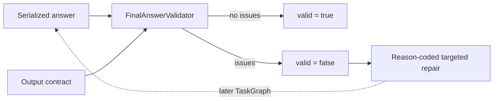

The structural reason-code families are:

- empty/non-string output;
- forbidden labels, explanatory prefixes, and Markdown;
- integer, fixed-point decimal, currency-symbol, grouping, and precision shape;
- delimiter, empty item, item count, duplicates, and deterministic list order;
- requested final-period mismatch;
- three-letter IOC-code shape; and
- supported SAN syntax shape.

`allow_duplicates` is false by default in `OutputContract`; a reviewed contract
must explicitly enable it when repeated list values are semantically required.
The validator accepts leading and trailing whitespace because the official grader
ignores it, but it does not return a stripped replacement. Exact-quote contracts
are exempt from generic prose/Markdown heuristics because those characters may be
the literal spoken answer.

Structural validation is intentionally not evidence verification. SAN shape does
not prove that a move is legal, and a well-formed quote does not prove what was
spoken. Historical-date evidence, timestamped ASR, workbook parity, chess-board
legality, uniqueness, and source quality remain later verifier policies. This
keeps A14 framework-independent and prevents false claims of verification.

### 13.2 Implemented Tier-1 deterministic replay

B07 fills the existing `TaskVerifier` port for the five Milestone B routes. It
does not add another graph node or an LLM critic. One registry binds a real
specialist solver to the fixed authority checks for its route:

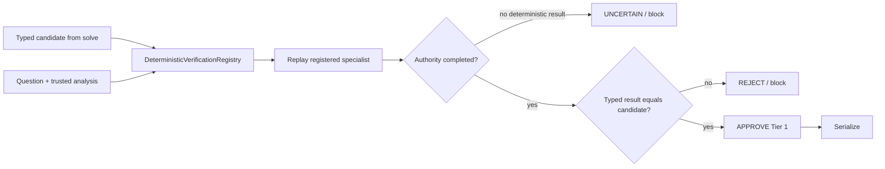

The replay is meaningful because each specialist already fails closed unless its
route-specific authority passes:

| Route | Authority that must pass during replay |
|---|---|
| `deterministic_text` | Exact reverse round trip and supported transform |
| `operation_table` | Closed table validation and all `n²` ordered pairs |
| `structured_table` | Complete-row min/max reduction and explicit tie rule |
| `code` | AST policy, two fresh interpreter runs, and static replay when supported |
| `spreadsheet` | Workbook audit plus exact openpyxl/Calamine row and total parity |

An approved result records answer-free `passed_checks`, including
`candidate_matches_authority`. A different reproduced answer is `REJECT`. A
known deterministic input or authority failure is `UNCERTAIN`. An unexpected
provider/runtime exception is allowed to escape to the TaskGraph so A16 can
checkpoint and retry it as infrastructure failure.

Registration is explicit. The normal assembly pattern is:

```python
solver = register_transformed_text_solver(solver_registry)
verifier_registry.register(SolverRoute.DETERMINISTIC_TEXT, solver)
```

The same instance may be registered, but verification invokes it again; it does
not reuse or trust the first answer. Source-backed providers are expected to read
the same content-addressed bytes. Later factual, temporal, retrieval, chess, and
media policies extend the ladder in their own stories instead of being faked by
this deterministic registry.

### 13.3 Property and poisoned-implementation tests

B08 tests invariants over many generated synthetic inputs rather than adding more
production abstractions. Hypothesis generates cases and shrinks any failure to a
small reproducible example. Tiny poisoned implementations live only in the test
module; they demonstrate that each oracle distinguishes the intended behavior
from a plausible bug.

| Mutation family | Generated invariant | Poisoned behavior detected |
|---|---|---|
| Off by one | The final row can be the unique maximum; operation tables report exactly `n²` comparisons | Skip the final row or pair |
| Tie | The selected result is invariant under source-row permutations | Select the first tied row |
| Ordering | Alphabetical output equals the contract's `(casefold, original)` order | Preserve input order |
| Floating point | Generated cent strings sum exactly as `Decimal` | Accumulate through binary `float` |
| Incomplete table | Removing any row from a generated closed table must fail | Validate widths but not row inventory |

These tests use no task IDs, official attachments, target questions, candidates,
or gold values. They complement ordinary example tests: examples explain known
edge cases, while generated properties search a much larger input space. A full
mutation-testing framework is intentionally unnecessary at this stage because
the five required mutations are small, explicit, fast, and reviewable.

## 14. Checkpoint and trace separation

LangGraph checkpoints are operational state. Evidence records and tool traces are audit data. They are linked but not identical.

```text
checkpoint:
    what the graph needs to resume

evidence store:
    what supports the candidate

trace store:
    what the system did, when, with which model/tool and cost
```

This separation keeps state compact and debugging rich.

## 15. Prompt boundaries

Use separate prompts for:

- Task analyzer
- Research planner
- Search query generator
- Page evidence extractor
- Vision frame analyzer
- Independent critic
- Adjudicator

All model outputs use structured schemas where supported.

The formatter is deterministic; it does not need a generative prompt.

## 16. Prompt-injection defense

Fetched content is untrusted data.

- Never place source content in the system-message role.
- Mark source boundaries explicitly.
- Tell models that source instructions cannot change objectives or tool policies.
- Flag common injection patterns for evidence review.
- Do not send secrets or raw environment variables to models.
- Use allowlisted URL schemes.
- Keep tool implementations in code; model output supplies validated parameters only.
- Limit download size, duration, and redirects.

### 16.1 Implemented C04 source-safety boundary

All research/model consumers must use `GuardedPageRetriever`, not the low-level
C03 ladder directly. It binds the retrieved document to `SourceBoundary`, which
reads the immutable extracted-text artifact, scans normalized Unicode, and emits
a `GuardedSourceDocument` plus content-free `SourceSafetyReport`.

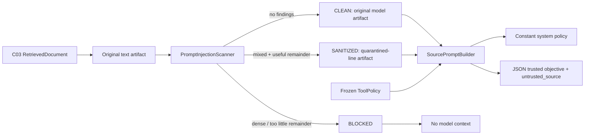

Scanner categories cover policy override, role impersonation, secret extraction,
tool manipulation, objective hijacking, data exfiltration, prompt-boundary
markers, and Unicode control obfuscation. Multiline rules are supported. Audit
findings contain line numbers and hashes but no attack excerpts. Original bytes
remain unchanged; suspicious whole lines are replaced only in a derived
model-visible artifact.

Thresholds for suspicious-line ratio, finding count, useful remaining text, and
maximum model-source characters have safe validated settings. Recognized
provider flags are merged conservatively; unknown flags fail closed. A provider
flag that cannot be localized by the deterministic scanner blocks model use.

`BoundedResearchPrompt` keeps objective, source artifact, messages, and frozen
tool policy as separate typed fields. Its system message explicitly says source
content is data and cannot redefine objectives, policies, tools, or benchmark
behavior. The user message uses JSON nesting, so source delimiter text cannot
escape into another role. No API accepts environment variables or credentials,
and `ToolPolicy.require_allowed` authorizes exact code-owned names regardless of
what the page requested.

## 17. Submission preflight

Preflight requires:

```text
current snapshot approved
AND exactly one result for each expected task ID
AND no unknown or duplicate IDs
AND no empty serialized answer
AND every task status is READY
AND every output contract passes
AND all required attachment, date, audio, video, chess, and spreadsheet checks pass
AND public Space code URL is valid
AND submission mode and ALLOW_SUBMIT are enabled
```

The final payload is frozen and hashed before the human interrupt. Resuming after approval submits that exact payload, not a recomputed one.

A19 implements only the structural, side-effect-free portion. `CandidatePreflight`
checks snapshot approval, exact count and ID inventory, READY status, and nonblank
serialized answers. A pass creates an immutable candidate ordered by the snapshot
and bound to a SHA-256 hash. The answer-redacted `DryRunReport` contains statuses,
counts, and issue codes only. There is still no submission client, HTTP write, or
approval node; evidence/modality gates are added with their specialist verifiers.

## 18. Deployment profiles

### Learning/local profile

- Local SQLite and artifacts
- Mocked providers where practical
- Low-cost or Hugging Face inference models
- Synthetic fixtures
- No submission

### Maximum-score profile

- Strong primary research model
- Different-family verifier and adjudicator
- Two vision paths
- Strong ASR plus independent fallback
- Two search providers
- Persistent artifacts/checkpoints
- Full risk dashboard

The course is free, but a serious maximum-score run may use paid search/model APIs or GPU compute. Cost remains configurable rather than hidden.

### 18.1 Media evidence pipeline

Audio and video are probed before use. Audio is normalized reproducibly to mono,
16 kHz signed PCM and stored as an immutable derived artifact that references its
source and time origin. ASR adapters must return ordered timestamped segments,
retain raw text, and expose confidence. Exact and numeric disagreements become
focused second-decode regions and cannot be silently averaged.

YouTube acquisition uses a manual-caption, automatic-caption, then downloaded
audio ladder. Exact speech is anchored to one cue and approved only when the
overlapping ASR interval agrees or a supported adjudication resolves the conflict.

Visual tasks sample the complete video coarsely, then candidate windows densely.
Every frame remains timestamp-addressable and can be rendered in a contact sheet.
Vision sensors return species names plus regions and confidence, never a bare
number. Two stable, distinct sensor identities inspect the same timestamps;
disagreement triggers targeted dense sampling and explicit adjudication. The
simultaneous maximum counts unique species, not individuals or transcript names.

## 19. Public/private boundary

Public repository:

- Source code
- Answer-free task profiles
- Synthetic fixtures
- Tests
- Architecture and learning documentation
- Dependency lockfiles

Private runtime data:

- Secrets
- Gated dataset artifacts
- Candidate answers
- Submission payloads
- Evidence caches that could expose gated material
- Full model traces containing task results

## 20. Definition of architectural completion

The architecture is implemented when:

- RunGraph and TaskGraph are typed, visualizable, and checkpointed.
- Every current task class maps to a specialist or tested fallback.
- Every solver returns semantic values and evidence rather than final strings.
- Verification policies are executable code.
- Serialization is deterministic and contract-aware.
- All current tasks can resume after interruption.
- Preflight makes an incomplete or unsafe submission impossible through the normal interface.
