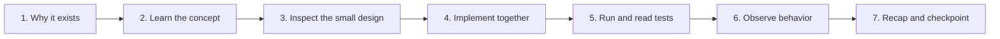

# Learning and Collaboration Workflow

## 1. How we will work together

Every implementation story is also a lesson. We will not jump directly from a requirement to a large unexplained code dump.

For each story, we will follow this cycle:



### Step 1: Why

Before editing code, explain:

- Which benchmark failure this prevents
- Which specification requirement it implements
- Why this component belongs at this layer

### Step 2: Concept

Teach only the concepts needed for the current story. Examples:

- Pydantic models before domain-model stories
- LangGraph state/nodes/edges before graph stories
- `Decimal` before spreadsheet currency stories
- MediaWiki revisions before historical Wikipedia stories
- FEN and SAN before chess implementation

### Step 3: Design

Show:

- Inputs
- Outputs
- Invariants
- Main failure paths
- The files we will change

### Step 4: Implementation

Implement a small vertical slice. Keep domain logic separate from providers and UI.

### Step 5: Tests

Tests are part of the story, not deferred cleanup. We will explain:

- What the test proves
- Why the fixture is legitimate
- Which failure it catches

### Step 6: Observation

Run the smallest useful demonstration and inspect structured output, graph state, trace, or generated diagram.

### Step 7: Recap

End each story with:

- What was learned
- What was built
- What remains intentionally incomplete
- How it connects to the next story

## 2. Story completion checklist

Every story must satisfy:

```text
[ ] Requirement and failure mode explained
[ ] Design and interfaces reviewed
[ ] Implementation complete
[ ] Unit tests added
[ ] Relevant integration or property test added
[ ] Tests pass
[ ] Type/lint checks pass for changed code
[ ] No secrets, gold answers, or target answer fixtures added
[ ] Documentation updated if behavior changed
[ ] Observable demonstration shown
[ ] Story status updated in the backlog
```

## 3. Teaching depth levels

We will use three levels depending on the component.

### Foundation level

For new concepts:

- Explain terminology
- Show a tiny standalone example
- Then connect it to GAIA

Used for Pydantic, async Python, LangGraph, tools, checkpointers, and dependency injection.

### Working level

For familiar Python components:

- Explain the design decision
- Implement directly
- Focus on tests and edge cases

Used for serializers, hashing, table processing, and configuration.

### Specialist level

For complex domains:

- Introduce the domain representation
- Build synthetic fixtures
- Implement the deterministic core
- Add model-based sensing only afterward

Used for chess, ASR, video analysis, historical revisions, and scholarly evidence.

## 4. Framework learning map

| Course concept | Project story where we practise it |
|---|---|
| Agent definition and environment | Research solver and tool interfaces |
| Thought–Action–Observation | smolagents research trace |
| Tool design | Retrieval and specialist tool stories |
| Function/tool calling | Structured model and search tools |
| smolagents CodeAgent/ToolCallingAgent | Deep-research epic |
| Managed agents | Research manager and web researcher |
| LangGraph state | Task and run state stories |
| LangGraph nodes and edges | TaskGraph skeleton |
| Conditional routing | Solver router and verification results |
| Persistence | SQLite checkpointer and resume tests |
| Human-in-the-loop | Submission approval interrupt |
| LlamaIndex components | Scholarly document passage finder |
| LlamaIndex QueryEngineTool | Optional research tool for long documents |
| Agentic RAG | Evidence-grounded document research |
| Observability | OpenTelemetry/Langfuse epic |
| Offline evaluation | Synthetic and non-target regression suites |
| Deployment | Public Docker Space and Gradio interface |

## 5. Beginner exercises alongside production work

Small exercises will be kept separate from production code, for example under `examples/` or notebooks that contain no target answers.

Suggested exercises:

1. Build a three-node LangGraph that classifies an attachment extension.
2. Add a conditional edge to route `.py` and `.xlsx` differently.
3. Compile it with an in-memory checkpointer.
4. Replace it with SQLite and resume after an intentional failure.
5. Create a smolagents tool that searches a local mock document.
6. Create a LlamaIndex query engine over a synthetic PDF.
7. Trace a mock agent call with OpenTelemetry.
8. Write a `Decimal` serializer and test punctuation variants.

These exercises teach the framework without contaminating the target evaluation.

## 6. Questions to ask during review

At the end of a story, you should be able to answer questions such as:

- What information belongs in graph state, and what belongs in the artifact store?
- Why is this edge deterministic or model-assisted?
- What makes an evidence path independent?
- What does the checkpointer save?
- Why can a semantic answer differ from a serialized answer?
- What condition makes this task block rather than retry?
- Which component is the decision authority for this modality?

If an answer is unclear, we pause and explain before beginning the next dependent story.

## Lean implementation rule

From A19 onward, optimize for score, learning, and debuggability—not framework
surface area. Keep an abstraction only when it removes a current-task risk or a
course requirement. Prefer small functions, focused tests, and one concise
explanation. Do not generalize for hypothetical GAIA tasks, force ordinary work
into graph nodes, or add infrastructure before a current solver needs it. Batch
closely related solver work where that shortens the path to a working dry run.

## 7. Working commands we will introduce gradually

Expected command interface:

```text
gaia snapshot
gaia inspect-task <task_id>
gaia run --dry-run
gaia run --task-id <task_id>
gaia run --resume <run_id>
gaia run --rerun-failed <run_id>
gaia run --rerun-uncertain <run_id>
gaia report <run_id>
gaia preflight <run_id>
gaia submit <run_id>
```

`gaia submit` remains disabled unless all explicit submission gates pass.

## 8. Progress tracking

The checkbox next to each story in [04_IMPLEMENTATION_BACKLOG.md](04_IMPLEMENTATION_BACKLOG.md) is the durable project status.

Status meanings:

- `[ ]` not started
- `[~]` in progress, represented in prose because Markdown has no standard partial checkbox
- `[x]` complete and acceptance criteria verified
- `BLOCKED` dependency or external access is missing

We update story status only after tests and acceptance checks, not merely after writing code.

## 9. When we may change the architecture

Architecture changes require a short decision record containing:

- Context
- Proposed change
- Score/reliability impact
- Learning impact
- Alternatives considered
- Migration effect on existing stories

We do not add a framework merely to demonstrate it. It must improve learning without becoming an unverified authority in the benchmark path.

## 10. First lesson

The first coding session will cover:

1. Python package layout and `pyproject.toml`
2. Why domain models come before agents
3. Safe configuration and submission defaults
4. A minimal Pydantic `Question` model
5. A minimal LangGraph state and graph visualization
6. Unit tests for the first model and safe defaults

That corresponds to stories `GAIA-A01` through `GAIA-A03`.
