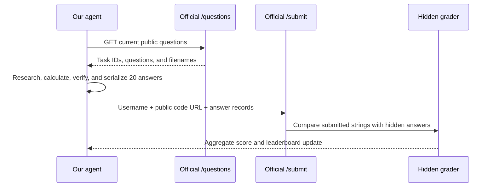
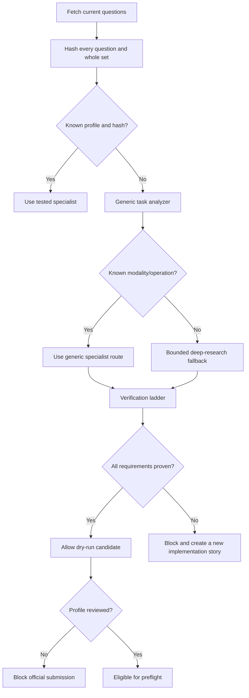

# Free Execution and Official Scoring

## 1. Does Hugging Face run our agent for us?

No. The current Unit 4 service does not remotely execute our repository or agent.

The workflow is:



Hugging Face provides the questions, attachment route, hidden comparison, aggregate score, and leaderboard. We provide the compute and model/tool execution that produce the answers.

## 2. Is the scoring free?

The course and official scoring API are free. A score above the current certificate threshold can be used on the official certificate page.

The scorer expects:

```json
{
  "username": "HF_USERNAME",
  "agent_code": "https://huggingface.co/spaces/HF_USERNAME/SPACE/tree/main",
  "answers": [
    {
      "task_id": "...",
      "submitted_answer": "..."
    }
  ]
}
```

The `agent_code` URL lets the course and leaderboard inspect the implementation. It is not an endpoint that the scorer calls to run the agent.

## 3. What can cost money?

Potential costs are outside the grader:

- Hosted LLM/VLM calls
- Commercial search APIs
- Hosted ASR
- Upgraded Space CPU/GPU hardware
- Persistent cloud storage

Hugging Face currently gives free users a small monthly Inference Providers credit, but that credit is not large enough to assume that a full multi-model 20-question run will be free. CPU Basic is listed at zero hourly cost, while current account/Space creation rules can change and must be checked again when we deploy.

Official references:

- Inference pricing: https://huggingface.co/docs/inference-providers/pricing
- Spaces overview: https://huggingface.co/docs/hub/spaces-overview
- Hardware pricing: https://huggingface.co/pricing

## 4. Our zero-spend policy

The project defaults to:

```text
ZERO_COST_MODE=true
ALLOW_PAID_SERVICES=false
DRY_RUN=true
ALLOW_SUBMIT=false
```

The configuration rejects contradictory zero-cost/paid-service settings.

Every future provider adapter must declare a cost class:

```text
LOCAL
FREE_UNMETERED
FREE_QUOTA
PAID
UNKNOWN
```

In zero-cost mode:

- `PAID` providers are forbidden.
- `UNKNOWN` providers are forbidden until reviewed.
- `FREE_QUOTA` providers require a quota check or explicit operator confirmation.
- There is no automatic fallback from a free failure to a paid request.

## 5. Zero-spend execution plan

### Run the agent locally

Use the learner's computer for:

- Python and spreadsheet computation
- Stockfish
- PDF parsing
- MediaWiki and public web retrieval
- `ffmpeg` and video frames
- Local ASR where hardware permits
- Local or freely available model inference where practical

### Use free/public sources

- MediaWiki APIs
- Publisher and institutional pages
- Public archives
- Direct HTTP retrieval
- Search backends that do not require paid API calls
- Official captions and public video/audio acquisition where permitted

### Use the Hugging Face Space for public code and operator UI

At deployment time, verify what the account can create under the then-current Spaces rules. If a free compute Space is available, it can run the light UI and orchestration. Heavy work may still run locally because CPU Basic is unsuitable for large local VLMs and can be slow for high-quality ASR/video workloads.

The certificate process is free, but free infrastructure does not guarantee that the strongest possible frontier-model ensemble is available. The project therefore separates:

```text
maximum-score architecture
from
provider choices permitted by the zero-spend policy
```

We will first make deterministic and retrieval tasks excellent without paid models, then evaluate the remaining high-risk vision/audio/research tasks against free local or quota-limited options.

## 6. Are the current image, audio, chess, Python, and Excel tasks the only tests?

At the moment, the official `/questions` endpoint exposes the complete current evaluation set of 20 public questions. The current shapes include:

- Historical and current web research
- Structured tables and classification
- Cross-lingual entity research
- Scholarly PDFs
- Two YouTube tasks
- One chess image
- Two audio attachments
- One Python attachment
- One Excel attachment

The scorer compares submissions against its filtered ground-truth task set. It does not secretly add a different question to our payload during a run.

However, the evaluation service loads and filters the dataset at runtime, so Hugging Face can update the dataset, filtering logic, questions, or backend later. External websites and media can also change or disappear.

## 7. How do we handle future or unexpected tasks?

The system protects itself in layers:



Important behavior:

- A changed snapshot never silently uses stale assumptions.
- Unknown tasks may be explored in dry mode.
- Existing generic solvers handle familiar file types and operations.
- Deep research handles unknown web paths.
- A truly new modality fails loudly instead of guessing.
- We add a new specialist and fixtures before official submission.

This gives us generality without weakening the 20/20 specialization strategy.

## 8. Connection code and safety boundary

The official integration is divided into stories:

1. `GAIA-A04`: read-only `/questions`, `/random-question`, and `/files` client.
2. `GAIA-A05`: immutable question snapshot.
3. `GAIA-A09` and `A10`: official attachment retrieval and gated fallback.
4. `GAIA-A18`: run all TaskGraphs and collect results.
5. `GAIA-A19`: dry-run preflight skeleton.
6. `GAIA-H03`: isolated, no-retry `/submit` client with configuration, exact-count,
   frozen-hash, owner approval, and checkpointed LangGraph interrupt/resume gates.

Submission is deliberately last. We should be able to build, learn, test, and dry-run nearly the whole system without risking an accidental official submission.

## 9. Free gated-attachment setup

The official GAIA attachment fallback does not require a paid Hugging Face plan or
inference credit. It does require legitimate individual dataset access:

1. Log in and open `https://huggingface.co/datasets/gaia-benchmark/GAIA`.
2. Review and accept the dataset's access and non-redistribution conditions.
3. Create a read-capable user access token.
4. Put `HF_TOKEN=...` in the local `.env` or the private Space secret settings.

The project sends this token only as an authentication header for one exact
attachment file. It does not load dataset records or publish downloaded gated
artifacts. A token without accepted dataset access fails with an explicit error.
